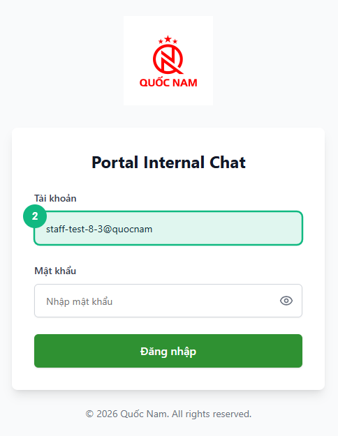
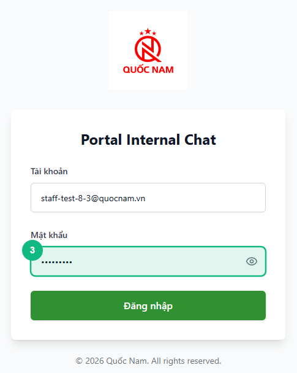
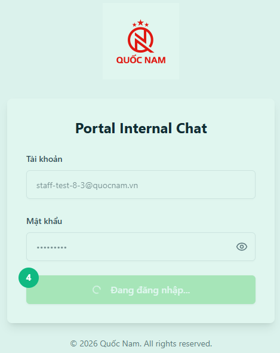
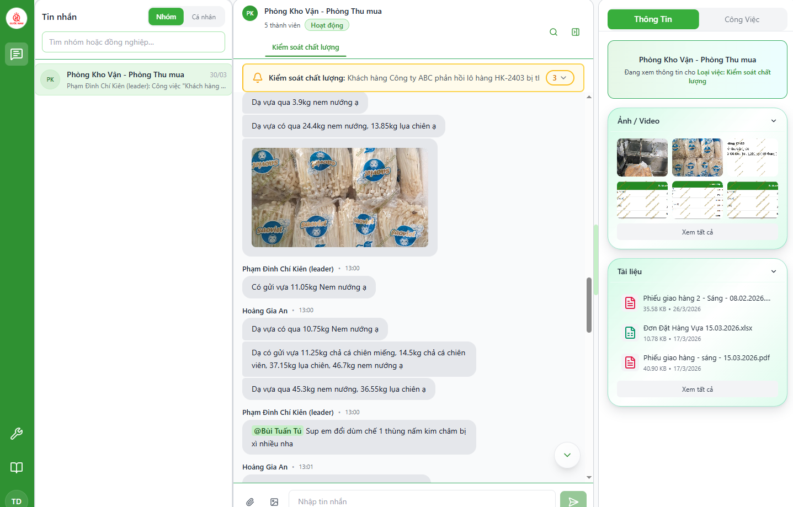
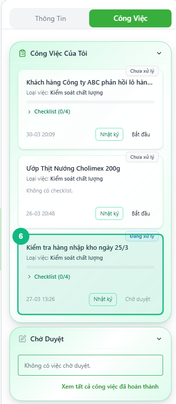

<Callout type="note" title="Mục tiêu">
Trong 5 phút, bạn sẽ đăng nhập, tìm thấy công việc được giao và bắt đầu thực hiện.
</Callout>

## Khi nào dùng

Bài hướng dẫn này dành cho nhân viên (staff) lần đầu sử dụng hệ thống Quốc Nam. Nó giúp bạn hiểu cách đăng nhập, xem danh sách công việc được giao và bắt đầu làm việc.

## Điều kiện

- Kết nối internet ổn định
- Đã nhận tài khoản nội bộ từ quản trị viên
- Trình duyệt hiện đại (Chrome, Firefox, Edge)

## Các bước

### Bước 1 — Truy cập trang đăng nhập

Mở trình duyệt và truy cập vào địa chỉ ứng dụng Portal Internal Chat. Bạn sẽ thấy trang đăng nhập hiển thị logo Quốc Nam ở giữa.

### Bước 2 — Nhập tài khoản email

Trong ô đầu tiên, nhập email nội bộ của bạn (ví dụ: tên@quocnam.com). Kiểm tra đúng chính tả trước khi tiếp tục.

### Bước 3 — Nhập mật khẩu

Trong ô thứ hai, nhập mật khẩu do quản trị viên cấp. Bạn có thể nhấp vào biểu tượng mắt để xem mật khẩu trước khi đăng nhập.

### Bước 4 — Bấm nút Đăng nhập

Sau khi nhập đầy đủ, bấm nút **Đăng nhập**. Chờ 1–2 giây để hệ thống xác thực.

### Bước 5 — Xem giao diện chính nhân viên

Bạn sẽ vào giao diện chính với ba vùng chính: danh sách nhóm/tin nhắn bên trái, khu vực chat ở giữa, và chi tiết công việc bên phải.

### Bước 6 — Mở danh sách công việc của bạn

Bấm vào tab hoặc menu chứa công việc được giao (thường có biểu tượng checkbox hoặc "Công việc"). Bạn sẽ thấy danh sách các task đang chờ thực hiện.

<Callout type="tip">
Các công việc thường được sắp xếp theo trạng thái: "Đang xử lý", "Chờ duyệt", "Hoàn thành". Chọn công việc có trạng thái "Đang xử lý" để bắt đầu.
</Callout>

## Kết quả mong đợi

Bạn đã đăng nhập thành công và có thể nhìn thấy:
- Tên của bạn ở góc trên cùng hoặc trong phần tài khoản
- Danh sách công việc được giao cho bạn
- Chi tiết từng công việc bao gồm tiêu đề, thời hạn, checklist, và file đính kèm

## Lỗi thường gặp

| Lỗi | Nguyên nhân | Cách xử lý |
|-----|-------------|-----------|
| "Email hoặc mật khẩu không đúng" | Nhập sai email hoặc mật khẩu | Kiểm tra lại tài khoản và mật khẩu (chú ý chữ hoa/thường) |
| "Tài khoản bị khóa" | Nhập sai mật khẩu quá 5 lần | Liên hệ quản trị viên để mở khóa |
| "Không kết nối được máy chủ" | Mất kết nối internet hoặc máy chủ gặp sự cố | Kiểm tra kết nối Wi-Fi/LAN và thử lại |
| Trang đăng nhập trắng | Trình duyệt không tương thích hoặc cache lỗi | Xóa cache (Ctrl+Shift+Del), thử trình duyệt khác |

## Bài liên quan

- [Cách chấp nhận công việc được giao](/web/staff-bat-dau-xu-ly)
- [Cách gửi kết quả công việc](/web/staff-gui-cho-duyet)
- [Cách sử dụng checklist trong công việc](/web/staff-checklist)

---

*Cập nhật lần cuối: 2026-04-14 — Phiên bản ứng dụng: 2.4.0*
