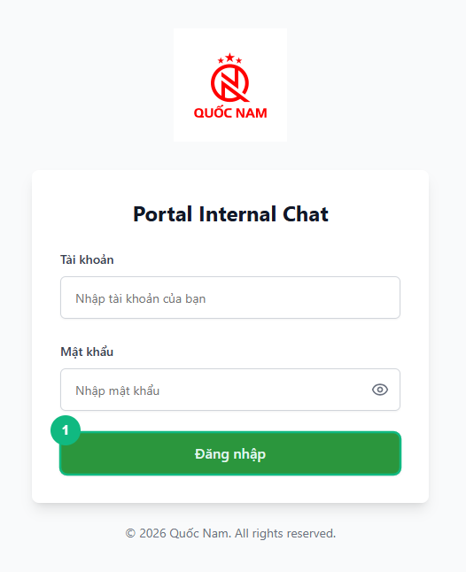
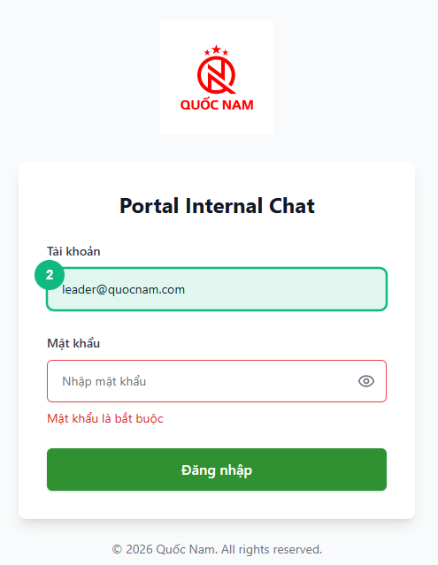
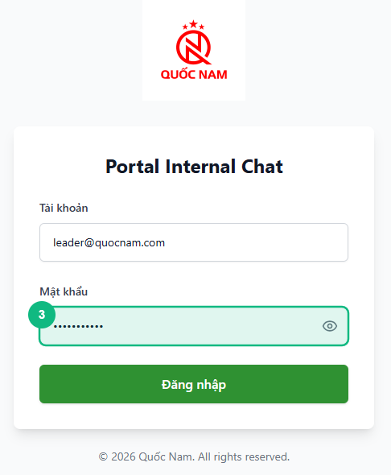
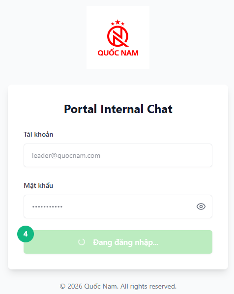
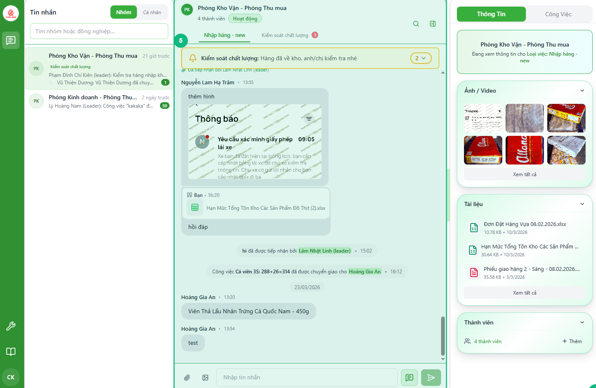
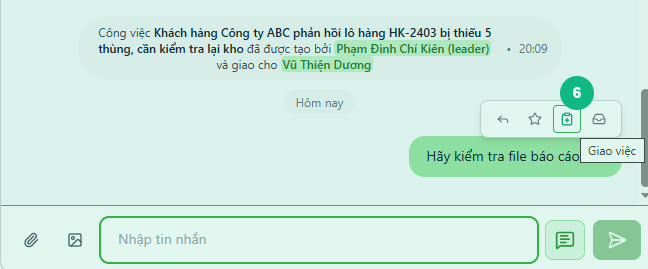
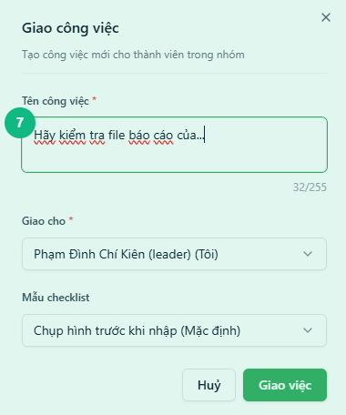
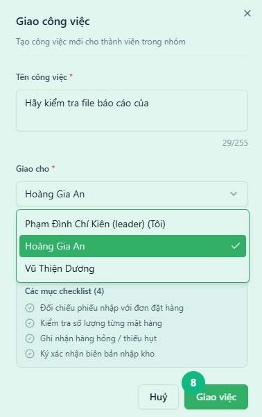

<Callout type="note" title="Mục tiêu">
Trong 5–10 phút, bạn sẽ đăng nhập vào giao diện quản lý, tạo công việc mới và giao cho nhân sự.
</Callout>

## Khi nào dùng

Bài hướng dẫn này dành cho trưởng nhóm/admin lần đầu sử dụng hệ thống Quốc Nam. Nó giúp bạn hiểu cách đăng nhập và truy cập giao diện quản lý, tạo công việc, và giao việc cho nhân viên.

## Điều kiện

- Kết nối internet ổn định
- Tài khoản có quyền trưởng nhóm hoặc admin
- Trình duyệt hiện đại (Chrome, Firefox, Safari, Edge)
- Danh sách nhân viên dưới quản lý của bạn đã được thêm vào hệ thống

## Các bước

### Bước 1 — Truy cập trang đăng nhập

Mở trình duyệt và truy cập vào địa chỉ ứng dụng Portal Internal Chat. Bạn sẽ thấy trang đăng nhập với logo Quốc Nam ở giữa màn hình.

### Bước 2 — Nhập tài khoản email

Trong ô đầu tiên, nhập email nội bộ của bạn (ví dụ: tên.quang@quocnam.com). Đảm bảo không có dấu cách hoặc ký tự lạ.

### Bước 3 — Nhập mật khẩu

Trong ô thứ hai, nhập mật khẩu do quản trị viên cấp. Bạn có thể nhấp vào biểu tượng mắt để hiển thị/ẩn mật khẩu.

### Bước 4 — Bấm nút Đăng nhập

Sau khi nhập đầy đủ thông tin, bấm nút **Đăng nhập**. Chờ 1–2 giây để hệ thống xác thực.

### Bước 5 — Xem giao diện chính của trưởng nhóm

Sau khi đăng nhập thành công, hệ thống sẽ **tự động nhận dạng quyền trưởng nhóm** và hiển thị giao diện quản lý. Bạn sẽ thấy khung chat, danh sách nhóm, và các công việc đang quản lý.

<Callout type="note">
Hệ thống tự động hiển thị giao diện phù hợp dựa trên quyền của tài khoản — bạn không cần chuyển chế độ thủ công.
</Callout>

### Bước 6 — Tìm tin nhắn cần tạo công việc

Trong khung chat, tìm một tin nhắn cần tạo công việc. Di chuột vào tin nhắn đó. Một **hàng nút hành động nhỏ** sẽ xuất hiện phía trên bong bóng tin nhắn.

<Callout type="tip">
Tin nhắn phải là **văn bản trong nhóm chat** (không áp dụng cho nhắn tin riêng). Nếu tin nhắn đã có biểu tượng công việc, nghĩa là đã được tạo rồi.
</Callout>

### Bước 7 — Bấm nút Giao việc và điền thông tin

Bấm vào biểu tượng **Giao việc** (hình bảng kẹp có dấu cộng +) trong hàng nút hành động. Tấm thông tin **Giao công việc** trượt ra từ bên phải. 

Tên công việc sẽ **tự động điền** từ nội dung tin nhắn. Sau đó:
- **Giao cho:** Chọn nhân viên hoặc chính bạn (có ghi chú "Tôi")
- **Mẫu danh sách kiểm tra:** (Tuỳ chọn) Chọn mẫu phù hợp hoặc bỏ qua

### Bước 8 — Bấm Giao việc

Sau khi điền xong, bấm nút **Giao việc** ở cuối tấm thông tin. Hệ thống tạo công việc, liên kết với tin nhắn gốc, và tự động chuyển sang tab **Công Việc**. Bạn sẽ thấy dòng thông báo hệ thống trong chat: *"Công việc '[tên công việc]' đã được tạo bởi [tên bạn] và giao cho [nhân viên]"*.

## Kết quả mong đợi

Sau khi hoàn tất, bạn sẽ:
- Đăng nhập thành công vào hệ thống
- Thấy giao diện quản lý trưởng nhóm với các tùy chọn quản lý công việc
- Tạo được công việc mới trong hệ thống
- Giao công việc cho nhân viên, họ sẽ nhận thông báo ngay

Nhân viên sẽ thấy công việc trong danh sách "Đang xử lý" của họ và có thể bắt đầu thực hiện.

## Lỗi thường gặp

| Lỗi | Nguyên nhân | Cách xử lý |
|-----|-------------|-----------|
| Giao diện hiển thị không đúng (nhìn như Staff view) | Tài khoản chưa được cấp quyền trưởng nhóm | Liên hệ admin để cấp quyền hoặc kiểm tra lại tài khoản |
| "Không thể tạo công việc" | Quyền chưa được kích hoạt hoặc nhân viên chưa được thêm vào hệ thống | Kiểm tra lại danh sách nhân viên, xác nhân viên có trong hệ thống không |
| Nhân viên không nhận được notification | Cài đặt thông báo bị tắt hoặc kết nối mất | Kiểm tra lại cài đặt thông báo, nên đặt trong chế độ "Luôn bật" |
| Email hoặc mật khẩu không đúng | Nhập sai thông tin hoặc tài khoản chưa được kích hoạt | Kiểm tra lại email, mật khẩu (chú ý chữ hoa/thường) hoặc liên hệ admin |

## Bài liên quan

- [Cách giao công việc cho nhân viên](/web/leader-tao-task)
- [Cách duyệt kết quả công việc](/web/leader-duyet-hoan-tat)
- [Cách theo dõi tiến độ nhóm](/web/leader-tong-quan-cong-viec)

---

*Cập nhật lần cuối: 2026-04-14 — Phiên bản ứng dụng: 2.4.0*
