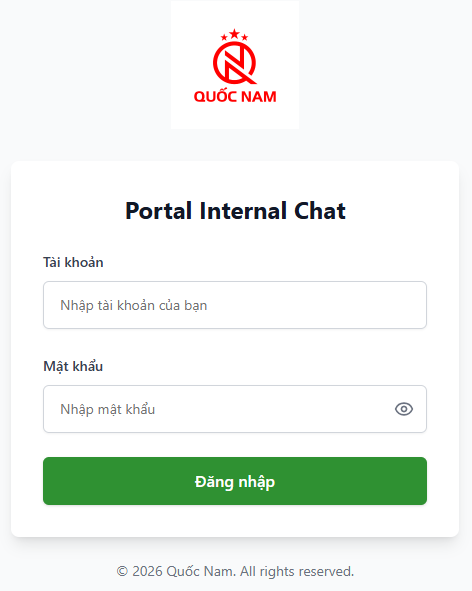
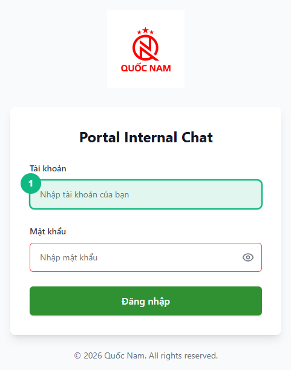
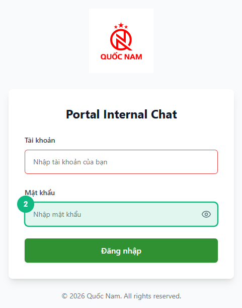
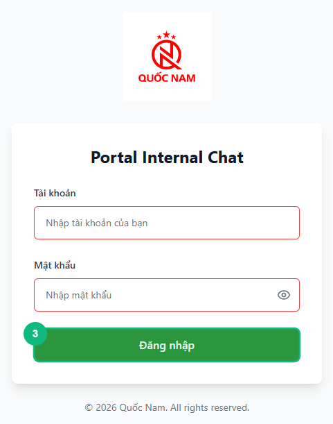

## Khi nào dùng  
Khi bạn đăng nhập hệ thống lần đầu sau khi được cấp tài khoản.

## Điều kiện  
- Đã có tài khoản (email / username)  
- Đã nhận mật khẩu từ hệ thống hoặc quản trị viên  

<Callout type="note">
Nếu chưa có tài khoản, hãy liên hệ quản trị viên để được cấp.
</Callout>

## Các bước  

### Bước 1 — Truy cập màn hình đăng nhập

Mở trình duyệt và truy cập vào đường dẫn hệ thống.
Màn hình đăng nhập sẽ hiển thị.

### Bước 2 — Nhập tài khoản

Nhập email hoặc tên đăng nhập vào ô tài khoản.

### Bước 3 — Nhập mật khẩu

Nhập mật khẩu được cung cấp vào ô mật khẩu.

### Bước 4 — Bấm đăng nhập

Bấm nút **Đăng nhập** để vào hệ thống.

## Kết quả mong đợi  
Bạn đăng nhập thành công và được chuyển vào màn hình chính của hệ thống.

## Lỗi thường gặp  

| Lỗi | Nguyên nhân | Cách xử lý |
|-----|-------------|------------|
| Không đăng nhập được | Sai tài khoản hoặc mật khẩu | Kiểm tra lại thông tin đăng nhập |
| Không đổi được mật khẩu | Mật khẩu không đúng định dạng | Nhập mật khẩu đủ ký tự theo yêu cầu |
| Không nhận được tài khoản | Chưa được cấp quyền | Liên hệ quản trị viên |

## Bài liên quan
- [Cách vào nhóm chat và gửi tin nhắn](/web/chat-nhom)
- [Câu hỏi thường gặp & xử lý lỗi](/faq)

---

*Cập nhật lần cuối: 2026-03-23 — Phiên bản ứng dụng: 1.0.0*