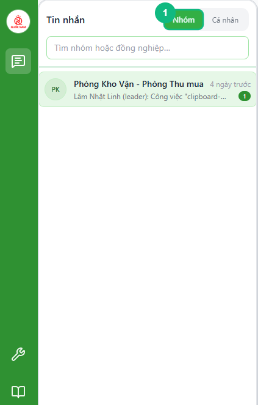
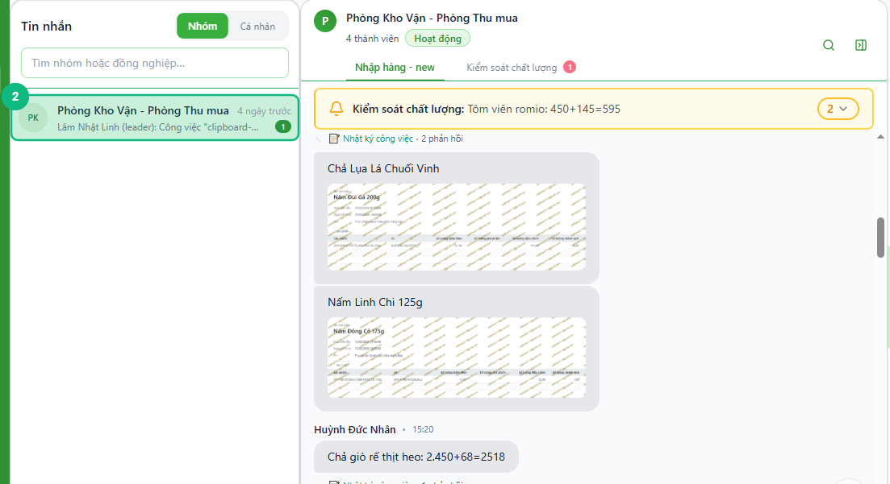
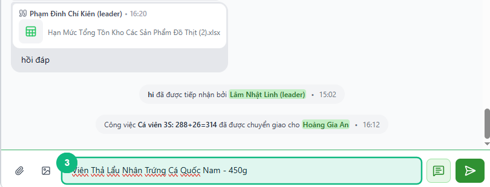
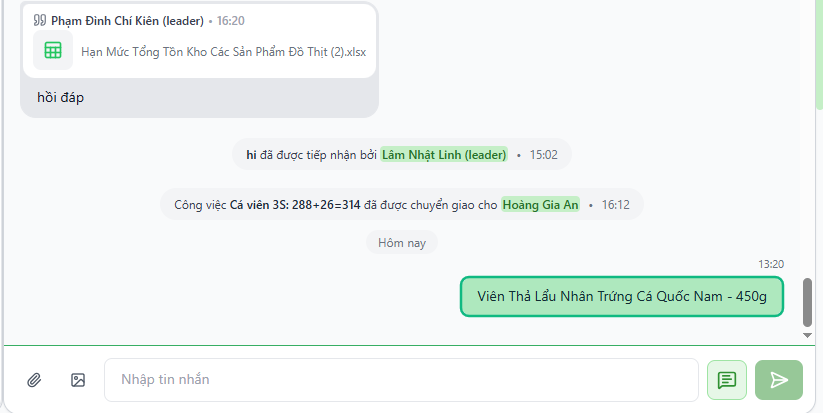

## Khi nào dùng
Khi bạn cần liên lạc với đồng nghiệp trong nhóm công việc hoặc trao đổi thông tin liên quan đến công việc hàng ngày.

## Điều kiện
- Đã đăng nhập vào hệ thống
- Đã được phân vào ít nhất một nhóm chat

<Callout type="note">
Nếu bạn không thấy nhóm chat nào, hãy liên hệ quản trị viên để được thêm vào nhóm phù hợp.
</Callout>

## Các bước

### Bước 1 — Chọn tab Nhóm ở thanh bên trái

Bấm vào tab **Nhóm** ở đầu thanh danh sách bên trái để xem tất cả nhóm chat bạn đang tham gia.

### Bước 2 — Chọn nhóm chat muốn vào

Bấm vào tên nhóm chat trong danh sách. Nhóm được chọn sẽ sáng lên và nội dung trò chuyện hiển thị ở khung bên phải.

<Callout type="tip">
Nhóm có số đỏ bên cạnh tên là nhóm đang có tin nhắn chưa đọc.
</Callout>

### Bước 3 — Nhập nội dung tin nhắn

Bấm vào ô **Nhập tin nhắn** ở phía dưới màn hình và gõ nội dung bạn muốn gửi.

### Bước 4 — Gửi tin nhắn

Bấm nút **Gửi** (mũi tên lên) hoặc nhấn **Ctrl + Enter** trên bàn phím để gửi tin nhắn.

## Kết quả mong đợi
Tin nhắn của bạn xuất hiện ở cuối khung chat. Các thành viên khác trong nhóm nhận được tin nhắn ngay lập tức.

## Lỗi thường gặp

| Lỗi | Nguyên nhân | Cách xử lý |
|-----|-------------|------------|
| Không thấy nhóm chat nào | Chưa được thêm vào nhóm | Liên hệ quản trị viên để được phân nhóm |
| Nút Gửi bị mờ, không bấm được | Ô tin nhắn đang trống | Nhập nội dung trước khi gửi |
| Tin nhắn không gửi được, hiện dấu ✗ | Mất kết nối mạng | Kiểm tra lại kết nối internet rồi bấm Thử lại |
| Màn hình hiện thông báo đỏ "Không có kết nối mạng" | Mất mạng trong lúc nhắn | Chờ kết nối trở lại, tin nhắn sẽ tự gửi lại |

## Bài liên quan
- [Cách đính kèm file trong chat và xem lại](../10-dinh-kem-file-chat)
- [Cách đăng nhập lần đầu vào hệ thống](/web/dang-nhap)

---

*Cập nhật lần cuối: 2026-03-23 — Phiên bản ứng dụng: 1.0.0*
