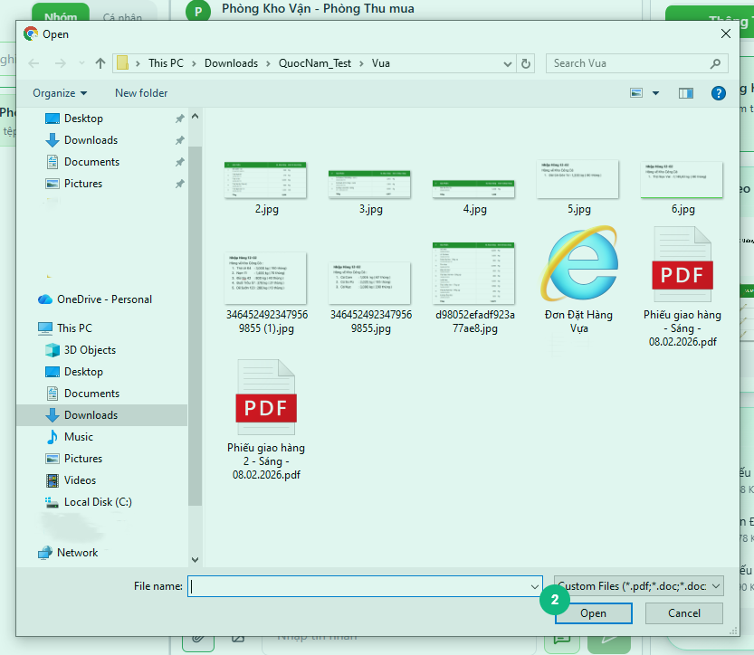
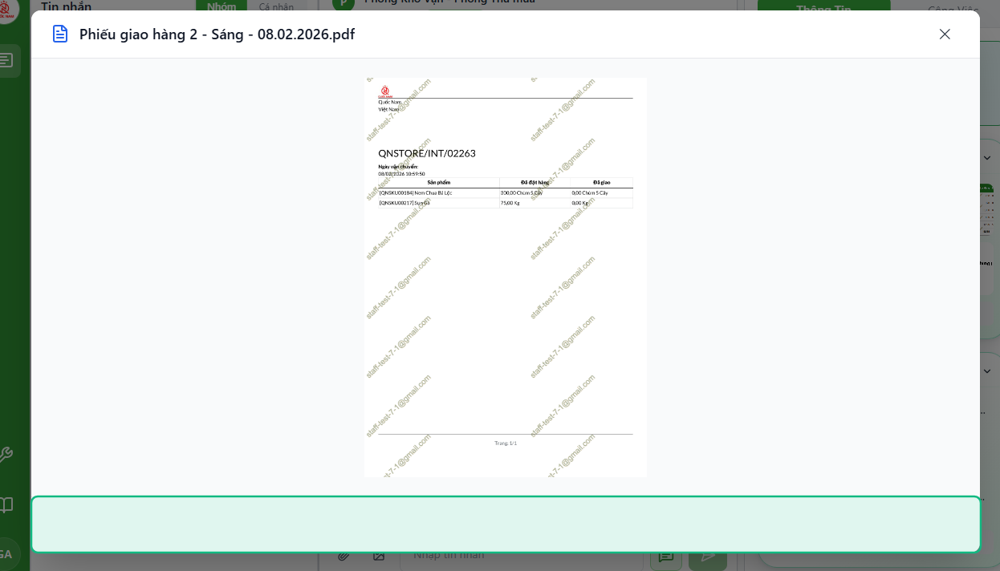

## Khi nào dùng
Khi bạn cần gửi tài liệu, hình ảnh hoặc video cho đồng nghiệp qua nhóm chat mà không cần dùng email hay ứng dụng khác.

## Điều kiện
- Đã đăng nhập và đang mở một nhóm chat
- File cần gửi không vượt quá **10 MB** mỗi file
- Tổng dung lượng tất cả file trong một lần gửi không vượt quá **100 MB**
- Gửi tối đa **10 file** trong một lần

<Callout type="note">
Định dạng được hỗ trợ: PDF, Word (.doc, .docx), Excel (.xls, .xlsx), hình ảnh (JPG, PNG, GIF, WebP) và video (MP4).
</Callout>

## Các bước

### Bước 1 — Bấm nút đính kèm để chọn file

Bấm vào biểu tượng **ghim** (📎) để đính kèm tài liệu, hoặc biểu tượng **hình ảnh** (🖼️) để chọn ảnh/video từ máy tính.

<Callout type="tip">
Bạn cũng có thể **dán ảnh trực tiếp** từ clipboard bằng cách bấm vào ô nhập tin nhắn rồi nhấn **Ctrl + V** — hệ thống sẽ tự động thêm ảnh vào mà không cần chọn file.
</Callout>

### Bước 2 — Chọn file từ máy tính

Cửa sổ chọn file mở ra. Chọn một hoặc nhiều file cần gửi rồi bấm **Mở**.

### Bước 3 — Kiểm tra file xem trước khi gửi

File được chọn hiển thị phía trên ô nhập tin nhắn cùng thanh tiến trình. Bấm **✕** nếu muốn bỏ file đó trước khi gửi.

### Bước 4 — Gửi file

Bấm nút **Gửi** (mũi tên lên) hoặc nhấn **Ctrl + Enter**. File tự động tải lên và xuất hiện trong khung chat khi hoàn tất.

### Bước 5 — Bấm vào file đã gửi để xem lại

Bấm vào hình thu nhỏ hoặc tên file trong tin nhắn để mở xem toàn màn hình. Với tài liệu nhiều trang, dùng nút **Trang trước / Trang sau** hoặc phím **← →** để lật trang.

## Kết quả mong đợi
File xuất hiện trong tin nhắn dưới dạng hình thu nhỏ (ảnh) hoặc biểu tượng tài liệu (PDF, Word, Excel). Mọi người trong nhóm có thể bấm vào để xem hoặc tải về.

## Lỗi thường gặp

| Lỗi | Nguyên nhân | Cách xử lý |
|-----|-------------|------------|
| Nút đính kèm bị mờ, không bấm được | Đã chọn đủ 10 file hoặc đang tải lên | Bỏ bớt file cũ rồi thêm file mới |
| Thông báo "File vượt quá 10MB" | File đơn lẻ quá lớn | Nén file hoặc chia nhỏ trước khi gửi |
| Thông báo "Tổng dung lượng vượt quá 100MB" | Tổng các file vượt giới hạn | Giảm số lượng hoặc dung lượng file |
| File không tải lên được, hiện lỗi đỏ | Mất kết nối mạng | Kiểm tra mạng rồi bấm **Thử lại** trên file đó |
| Định dạng không hỗ trợ | File không thuộc định dạng cho phép | Chuyển đổi sang PDF, JPG hoặc PNG trước khi gửi |

## Bài liên quan
- [Cách vào nhóm chat và gửi tin nhắn](/web/chat-nhom)
- [Cách xem hồ sơ file gắn với task/chat](/web/xem-ho-so-file)

---

*Cập nhật lần cuối: 2026-03-23 — Phiên bản ứng dụng: 1.0.0*
