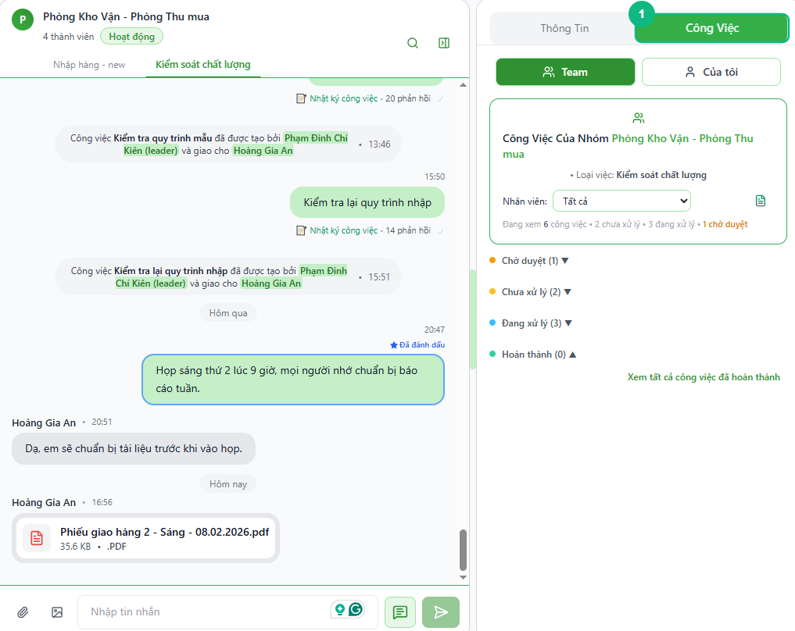
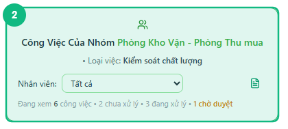
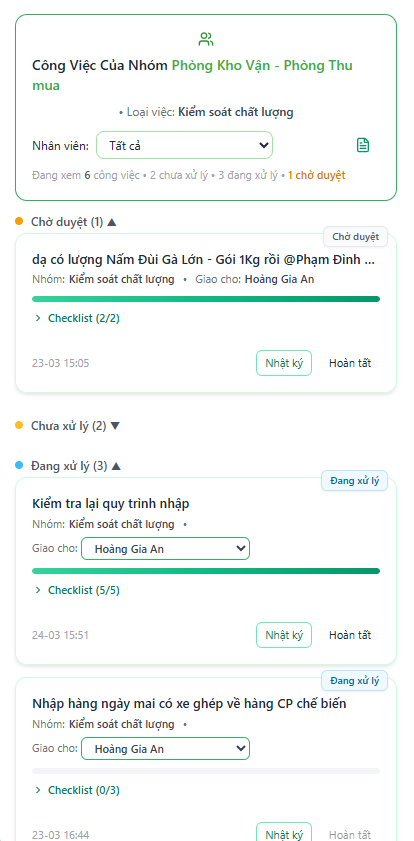
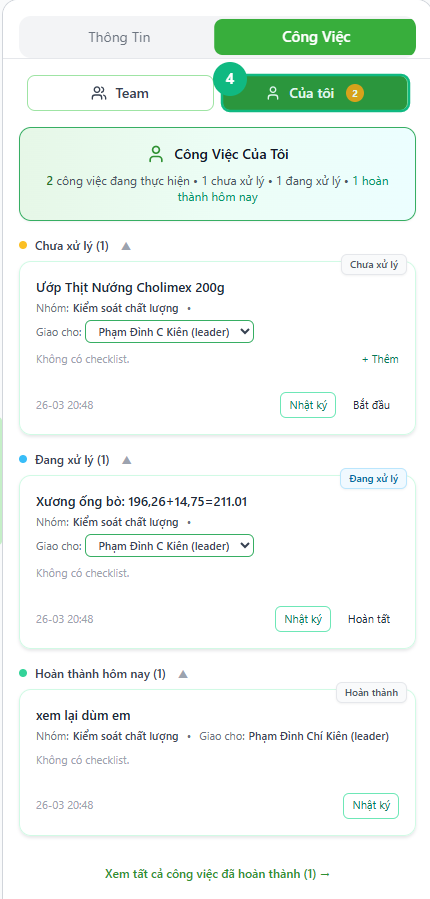

## Khi nào dùng
Khi bạn muốn nắm bức tranh toàn cảnh công việc của nhóm theo từng loại việc — xem ai đang làm gì, bao nhiêu việc chờ duyệt, hay kiểm tra nhanh công việc đang được giao cho chính mình.

## Điều kiện
- Đã đăng nhập với vai trò Leader hoặc Admin
- Đang ở trong một nhóm chat có ít nhất một loại việc được cấu hình

<Callout type="note">
Tab **Công Việc** chỉ xuất hiện trong nhóm chat, không có ở nhắn tin riêng. Nếu bạn không thấy tab này, hãy chuyển sang một nhóm chat.
</Callout>

## Các bước

### Bước 1 — Mở tab Công Việc ở cột bên phải

Trong nhóm chat đang mở, bấm vào tab **Công Việc** ở cột bên phải. Hệ thống hiển thị chế độ xem dành cho Leader với 2 nút chuyển đổi ở trên cùng: **Nhóm** và **Của tôi**.

<Callout type="tip">
Nếu cột bên phải đang bị ẩn, bấm vào nút mở cột ở góc trên phải khung chat để hiện lên.
</Callout>

### Bước 2 — Chọn loại việc muốn xem

Chọn một loại việc trong thanh điều hướng (cột trái hoặc thanh thông báo công việc phía trên). Khi đã chọn, phần tiêu đề hiển thị tổng số công việc đang thực hiện kèm thống kê nhanh: **chưa xử lý**, **đang xử lý**, **chờ duyệt**.

### Bước 3 — Xem công việc toàn nhóm ở chế độ "Nhóm"

Bấm nút **Nhóm** để xem tất cả công việc của nhân viên trong loại việc đó. Công việc được chia thành 3 nhóm: **Chờ duyệt** (vàng), **Chưa xử lý** (cam), **Đang xử lý** (xanh). Bấm tên nhân viên trong ô lọc để chỉ xem việc của một người cụ thể.

### Bước 4 — Chuyển sang chế độ "Của tôi" để xem việc của bản thân

Bấm nút **Của tôi** để lọc chỉ những công việc được giao cho chính bạn. Nếu đang có việc chưa xong, số lượng sẽ hiển thị bằng chấm tròn màu vàng bên cạnh tên nút.

## Kết quả mong đợi
Tab Công Việc hiển thị đầy đủ danh sách theo từng nhóm trạng thái. Chế độ **Nhóm** cho thấy công việc của toàn bộ nhân viên; chế độ **Của tôi** thu hẹp về việc của riêng bạn. Bấm vào một công việc bất kỳ để xem chi tiết hoặc thực hiện hành động tiếp theo.

## Lỗi thường gặp

| Lỗi | Nguyên nhân | Cách xử lý |
|-----|-------------|------------|
| Không thấy tab Công Việc | Đang ở nhắn tin riêng, không phải nhóm chat | Chuyển sang nhóm chat bất kỳ |
| Chọn loại việc rồi nhưng danh sách vẫn trống | Loại việc chưa có công việc nào, hoặc tất cả đã hoàn thành | Kiểm tra lại bộ lọc nhân viên — thử chọn "Tất cả" |
| Thống kê số lượng sai so với thực tế | Dữ liệu chưa kịp cập nhật | Chờ vài giây hoặc tải lại trang — số cập nhật tự động theo thời gian thực |
| Không thấy nút "Nhóm" / "Của tôi" | Đang dùng tài khoản Staff (không có quyền Leader) | Liên hệ quản trị viên để được cấp quyền phù hợp |

## Bài liên quan
- [Cách tạo task mới](../12-leader-tao-task)
- [Cách giao task cho nhân viên](../13-leader-giao-task)
- [Cách xem thanh thông báo công việc và điều hướng nhanh](../31-notification-banner)

---

*Cập nhật lần cuối: 2026-03-25 — Phiên bản ứng dụng: 1.0.0*
