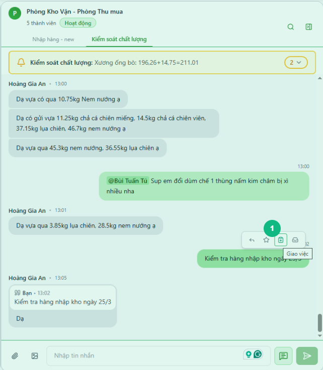
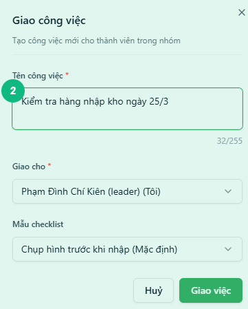
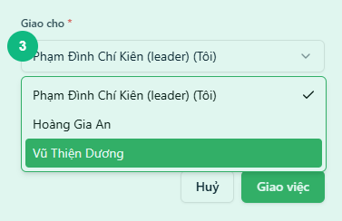
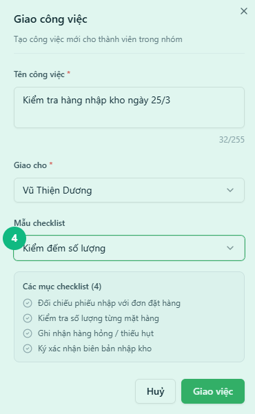
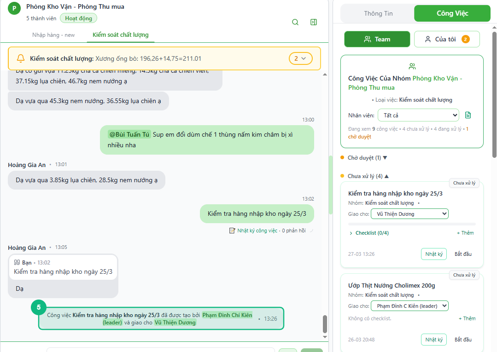

## Khi nào dùng
Khi bạn đọc được một tin nhắn cần xử lý trong nhóm chat và muốn tạo ngay một công việc giao cho nhân viên — mà không cần rời khỏi màn hình chat.

## Điều kiện
- Đã đăng nhập với vai trò Leader hoặc Admin
- Đang mở một nhóm chat (không áp dụng cho nhắn tin riêng)
- Tin nhắn cần tạo công việc **chưa được liên kết** với công việc nào khác

<Callout type="note">
Nút tạo công việc chỉ hiện khi di chuột vào tin nhắn và tin nhắn đó chưa có công việc liên kết. Nếu tin nhắn đã có biểu tượng công việc, nghĩa là đã được tạo rồi.
</Callout>

## Các bước

### Bước 1 — Di chuột vào tin nhắn cần tạo công việc

Di chuột vào tin nhắn trong khung chat. Một hàng nút hành động nhỏ xuất hiện phía trên bong bóng tin nhắn. Bấm vào biểu tượng **Giao việc** (hình bảng kẹp có dấu cộng).

### Bước 2 — Nhập tên công việc

Tấm thông tin trượt ra từ bên phải. Ô **Tên công việc** được tự động điền từ nội dung tin nhắn. Chỉnh sửa nếu cần cho rõ ràng hơn, tối đa 255 ký tự.

### Bước 3 — Chọn người thực hiện

Bấm vào ô **Giao cho** và chọn tên nhân viên trong danh sách. Nếu bạn muốn tự nhận việc, chọn tên mình (có ghi chú **"(Tôi)"** bên cạnh).

### Bước 4 — Chọn mẫu danh sách kiểm tra

Chọn **Mẫu danh sách kiểm tra** phù hợp với loại công việc. Các mục trong mẫu hiện ra phía dưới để bạn xem trước. Nếu không có mẫu nào phù hợp, bỏ qua phần này.

### Bước 5 — Bấm Giao việc

Bấm nút **Giao việc** ở cuối tấm thông tin. Hệ thống tạo công việc, liên kết với tin nhắn gốc và tự động chuyển sang tab **Công Việc** để bạn xem kết quả.

## Kết quả mong đợi
Một dòng thông báo hệ thống xuất hiện trong khung chat: *"Công việc '[tên công việc]' đã được tạo bởi [tên bạn] và giao cho [tên nhân viên]"*. Tin nhắn gốc hiện thêm biểu tượng công việc. Tab **Công Việc** bên phải hiển thị công việc mới trong nhóm trạng thái **Chưa xử lý**.

## Lỗi thường gặp

| Lỗi | Nguyên nhân | Cách xử lý |
|-----|-------------|------------|
| Không thấy biểu tượng **Giao việc** khi di chuột | Tin nhắn đã có công việc liên kết, hoặc đang ở nhắn tin riêng | Kiểm tra xem tin nhắn đã có biểu tượng công việc chưa; chuyển sang nhóm chat nếu cần |
| Ô **Giao cho** không có tên nhân viên nào | Nhóm chat chưa có thành viên nào được phân vào phòng ban | Liên hệ quản trị viên thêm thành viên vào nhóm |
| Không có **Mẫu danh sách kiểm tra** nào | Loại việc chưa được cấu hình mẫu | Tạo công việc bình thường mà không chọn mẫu; liên hệ quản trị viên cấu hình mẫu sau |
| Thông báo "Không thể tạo công việc" | Lỗi kết nối hoặc hết phiên đăng nhập | Kiểm tra mạng và thử lại; nếu vẫn lỗi thì tải lại trang |

## Bài liên quan
- [Cách giao công việc cho nhân viên](/web/13-leader-giao-task)
- [Cách xem tổng quan tab Công Việc theo Loại Việc](/web/11-leader-tong-quan-cong-viec)
- [Cách chuyển trạng thái công việc](/web/15-leader-chuyen-trang-thai)

---

*Cập nhật lần cuối: 2026-03-25 — Phiên bản ứng dụng: 1.0.0*
