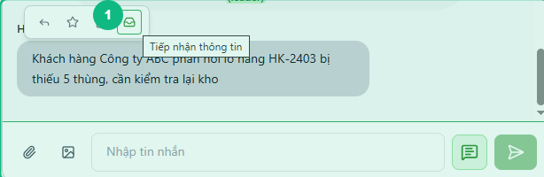
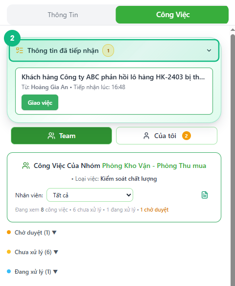
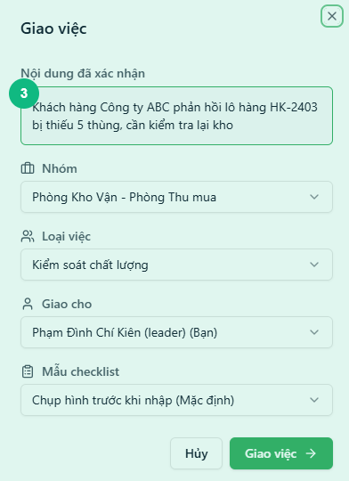
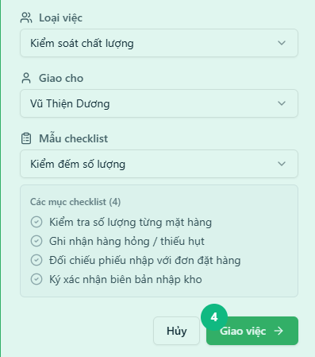
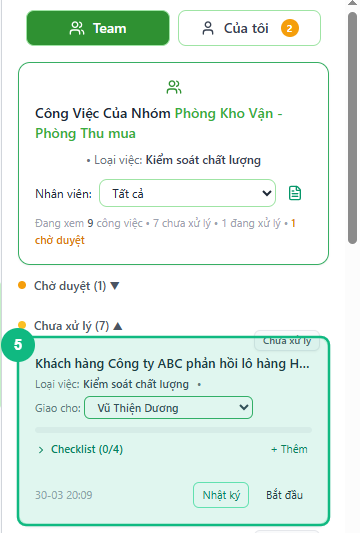

## Khi nào dùng
Khi bạn đọc một tin nhắn quan trọng trong nhóm chat và muốn ghi nhận lại để xử lý — rồi tạo công việc giao cho nhân viên dựa trên thông tin đó, mà không lo bị bỏ sót giữa dòng chat.

## Điều kiện
- Đã đăng nhập với vai trò Leader hoặc Admin
- Đang mở một nhóm chat có tin nhắn của thành viên khác (không áp dụng cho tin nhắn hệ thống)
- Tin nhắn cần xử lý **chưa được tiếp nhận trước đó**

<Callout type="note">
Luồng này gồm hai giai đoạn: **Tiếp nhận** (ghi nhận thông tin quan trọng) rồi mới **Giao việc** (tạo công việc cho nhân viên). Bạn có thể tiếp nhận ngay lúc đọc chat, giao việc sau khi cân nhắc.
</Callout>

## Các bước

### Bước 1 — Di chuột vào tin nhắn, bấm Tiếp nhận thông tin

Di chuột vào tin nhắn cần theo dõi. Hàng nút hành động xuất hiện phía trên bong bóng — bấm biểu tượng **Tiếp nhận thông tin** (hình hộp thư đến).

<Callout type="tip">
Nút tiếp nhận chỉ hiện với tin nhắn của người khác, chưa được tiếp nhận trước đó và chưa được liên kết với công việc nào.
</Callout>

### Bước 2 — Kiểm tra thông tin vừa xuất hiện trong tab Công Việc

Bảng bên phải tự động mở sang tab **Công Việc**. Phần **Thông tin đã tiếp nhận** hiện ra ở đầu danh sách, hiển thị nội dung tin nhắn vừa tiếp nhận kèm thẻ số đang chờ xử lý.

### Bước 3 — Bấm Giao việc trên thẻ thông tin

Bấm nút **Giao việc** trên thẻ thông tin cần xử lý. Tấm giao việc trượt ra từ bên phải, ô **Tên công việc** đã được tự điền từ nội dung tin nhắn.

### Bước 4 — Chọn nhân viên nhận việc và mẫu danh sách kiểm tra

Chọn tên nhân viên trong ô **Giao cho**, sau đó chọn **Mẫu danh sách kiểm tra** phù hợp nếu có. Các mục trong mẫu hiển thị bên dưới để xem trước.

### Bước 5 — Bấm Giao việc để hoàn tất

Bấm nút **Giao việc** ở cuối tấm. Thẻ thông tin chuyển sang trạng thái **Đã giao** và công việc mới xuất hiện trong danh sách nhóm **Chưa xử lý** phía dưới.

## Kết quả mong đợi
Thẻ thông tin tiếp nhận hiển thị dòng **"✓ Đã giao việc"** — xác nhận đã có công việc được tạo từ thông tin đó. Một dòng thông báo hệ thống xuất hiện trong khung chat và công việc mới hiển thị trong tab **Công Việc** ở nhóm **Chưa xử lý**.

## Lỗi thường gặp

| Lỗi | Nguyên nhân | Cách xử lý |
|-----|-------------|------------|
| Không thấy biểu tượng Tiếp nhận khi di chuột | Đang dùng tài khoản Staff, hoặc tin nhắn đã được tiếp nhận rồi | Kiểm tra vai trò tài khoản; nếu đã tiếp nhận thì vào phần **Thông tin đã tiếp nhận** để giao việc |
| Tấm giao việc mở ra nhưng danh sách nhân viên trống | Nhóm chat chưa có thành viên được phân công đúng phòng ban | Liên hệ quản trị viên cập nhật lại phòng ban và nhóm |
| Thông tin tiếp nhận không xuất hiện trong tab Công Việc | Bảng bên phải đang đóng hoặc đang ở tab **Thông Tin** | Bấm nút mở bảng bên phải hoặc chuyển sang tab **Công Việc** |
| Thông báo "Tin nhắn này đã được tiếp nhận trước đó" | Một Leader khác đã tiếp nhận tin nhắn này rồi | Vào phần **Thông tin đã tiếp nhận** để xem thẻ hiện có, rồi giao việc từ đó |

## Bài liên quan
- [Cách tạo công việc mới từ tin nhắn](../12-leader-tao-task)
- [Cách đổi người xử lý công việc](../14-leader-doi-nguoi-xu-ly)
- [Cách tiếp nhận thông tin từ tin nhắn](../16-leader-tiep-nhan-thong-tin)

---

*Cập nhật lần cuối: 2026-03-25 — Phiên bản ứng dụng: 1.0.0*
