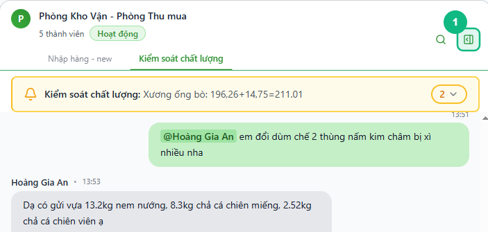
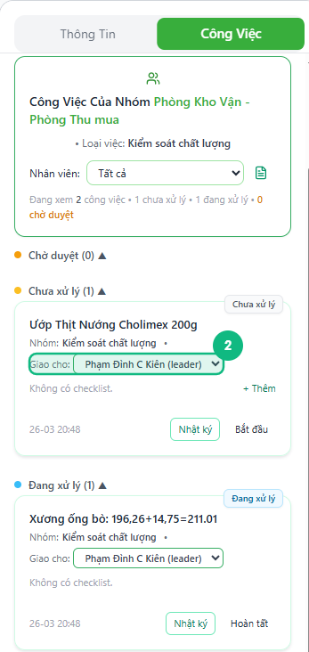
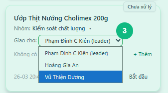
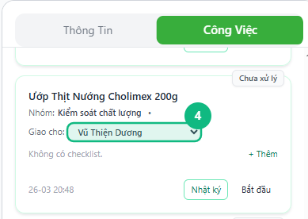

## Khi nào dùng
Khi một công việc đã được giao nhưng cần chuyển sang người khác — ví dụ nhân viên nghỉ phép, quá tải, hoặc công việc phù hợp hơn với người có chuyên môn khác.

## Điều kiện
- Đã đăng nhập với vai trò Leader hoặc Admin
- Đang mở nhóm chat có tab **Công Việc** ở bảng bên phải
- Công việc cần đổi đang ở trạng thái **Chưa xử lý** hoặc **Đang xử lý**

<Callout type="warning">
Không thể đổi người xử lý khi công việc đang ở trạng thái **Chờ duyệt** hoặc đã **Hoàn thành** — ô chọn người sẽ chuyển thành chữ tĩnh, không bấm được.
</Callout>

## Các bước

### Bước 1 — Mở tab Công Việc ở bảng bên phải

Bấm vào biểu tượng mở bảng bên phải nếu bảng đang đóng, rồi bấm tab **Công Việc**.

### Bước 2 — Tìm công việc cần đổi người

Cuộn qua các nhóm **Chưa xử lý** và **Đang xử lý** để tìm thẻ công việc cần thay đổi. Dòng **Giao cho** hiển thị tên người đang xử lý hiện tại dưới dạng ô chọn.

### Bước 3 — Bấm vào ô Giao cho và chọn người mới

Bấm vào ô **Giao cho** ngay trên thẻ công việc. Danh sách thành viên trong nhóm xổ xuống — chọn tên người sẽ tiếp nhận công việc này.

### Bước 4 — Kiểm tra thẻ công việc sau khi đổi

Ô **Giao cho** cập nhật ngay lập tức sang tên người mới. Không cần bấm thêm bất kỳ nút xác nhận nào.

## Kết quả mong đợi
Dòng **Giao cho** trên thẻ công việc hiển thị tên người mới. Người được chuyển việc sẽ thấy công việc xuất hiện trong danh sách của họ khi vào lại hệ thống.

## Lỗi thường gặp

| Lỗi | Nguyên nhân | Cách xử lý |
|-----|-------------|------------|
| Dòng **Giao cho** hiển thị chữ tĩnh, không bấm được | Công việc đang ở trạng thái **Chờ duyệt** hoặc **Hoàn thành** | Không thể đổi ở các trạng thái này — cần chuyển trạng thái về **Đang xử lý** trước nếu thật sự cần thiết |
| Danh sách xổ xuống chỉ có 1 tên | Nhóm chat chỉ có 1 nhân viên | Liên hệ quản trị viên để thêm thành viên vào nhóm |
| Không thấy tab Công Việc | Đang dùng tài khoản Staff | Tính năng này chỉ dành cho Leader và Admin |
| Sau khi chọn, ô vẫn hiển thị tên cũ | Lỗi kết nối mạng, thay đổi chưa được lưu | Tải lại trang và thực hiện lại |

## Bài liên quan
- [Cách giao công việc cho nhân viên từ thông tin tiếp nhận](/web/13-leader-giao-task)
- [Cách chuyển trạng thái công việc](/web/15-leader-chuyen-trang-thai)
- [Cách tạo công việc mới từ tin nhắn](/web/12-leader-tao-task)

---

*Cập nhật lần cuối: 2026-03-25 — Phiên bản ứng dụng: 1.0.0*
