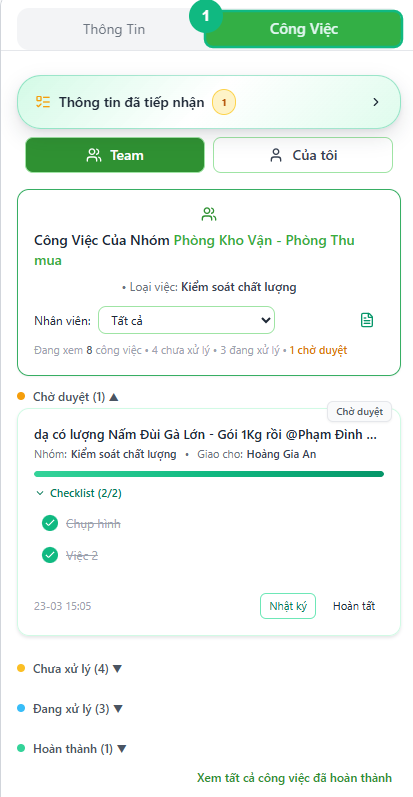
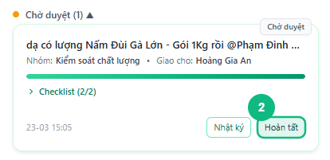
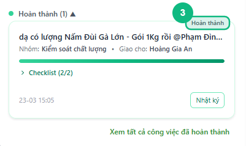

## Khi nào dùng
Khi bạn cần thay đổi tiến trình của một công việc — ví dụ khởi động công việc đang chờ, hoặc duyệt hoàn tất khi nhân viên đã nộp kết quả.

## Điều kiện
- Đã đăng nhập với vai trò Leader hoặc Admin
- Đang mở nhóm chat có tab **Công Việc** ở bảng bên phải
- Công việc cần chuyển đang hiển thị trong danh sách

<Callout type="note">
Có bốn trạng thái theo thứ tự: **Chưa xử lý → Đang xử lý → Chờ duyệt → Hoàn thành**. Leader có thể chuyển công việc từ bất kỳ trạng thái nào sang **Hoàn thành** mà không cần qua bước Chờ duyệt, miễn là danh sách kiểm tra (nếu có) đã được đánh dấu đầy đủ.
</Callout>

## Các bước

### Bước 1 — Mở tab Công Việc và tìm thẻ công việc cần chuyển

Bấm tab **Công Việc** ở bảng bên phải. Các công việc được nhóm theo trạng thái — cuộn để tìm thẻ cần thay đổi.

### Bước 2 — Bấm nút chuyển trạng thái trên thẻ công việc

Góc dưới phải của mỗi thẻ công việc có các nút hành động. Bấm nút tương ứng với trạng thái muốn chuyển sang:

- **Bắt đầu** — chuyển từ **Chưa xử lý** sang **Đang xử lý**
- **Hoàn tất** — chuyển từ **Đang xử lý** hoặc **Chờ duyệt** sang **Hoàn thành** (chỉ Leader/Admin)

<Callout type="tip">
Khi nhân viên đã bấm **Chờ duyệt**, công việc xuất hiện nổi bật ở đầu danh sách (nhóm **Chờ duyệt**). Bấm **Hoàn tất** trên thẻ đó để duyệt và đóng công việc.
</Callout>

### Bước 3 — Kiểm tra kết quả trên thẻ công việc

Nhãn trạng thái ở góc trên phải của thẻ đổi màu và cập nhật tên mới ngay lập tức. Thẻ tự động chuyển sang đúng nhóm tương ứng trong danh sách.

## Kết quả mong đợi
Trạng thái trên thẻ công việc cập nhật ngay lập tức. Hệ thống tự động gửi một tin nhắn thông báo vào luồng chat của công việc đó, ví dụ: *"Nguyễn Văn A đã chuyển trạng thái công việc [tên] sang Hoàn thành."*

## Lỗi thường gặp

| Lỗi | Nguyên nhân | Cách xử lý |
|-----|-------------|------------|
| Nút **Hoàn tát** bị mờ, không bấm được | Danh sách kiểm tra chưa được đánh dấu hết | Di chuột vào nút sẽ thấy gợi ý — mở thẻ công việc và tick đủ các mục trước |
| Không thấy nút hành động nào trên thẻ | Công việc đã ở trạng thái **Hoàn thành** | Không cần thao tác — công việc đã kết thúc |
| Bấm nút nhưng trạng thái không đổi | Mất kết nối mạng | Kiểm tra kết nối rồi bấm lại |
| Không thấy tab Công Việc | Đang dùng tài khoản Staff | Tính năng chuyển trạng thái đầy đủ chỉ dành cho Leader và Admin |

## Bài liên quan
- [Cách đổi người xử lý công việc](../14-leader-doi-nguoi-xu-ly)
- [Staff: Bắt đầu xử lý công việc](../18-staff-bat-dau-xu-ly)
- [Staff: Gửi công việc chờ duyệt](../20-staff-gui-cho-duyet)

---

*Cập nhật lần cuối: 2026-03-25 — Phiên bản ứng dụng: 1.0.0*
