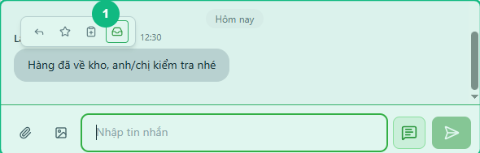
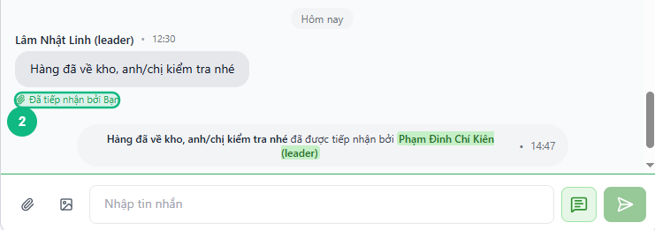
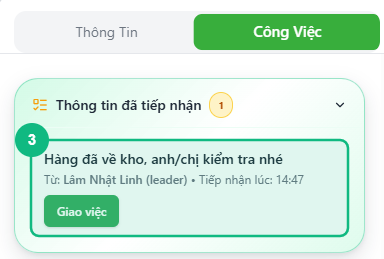
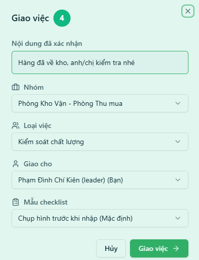
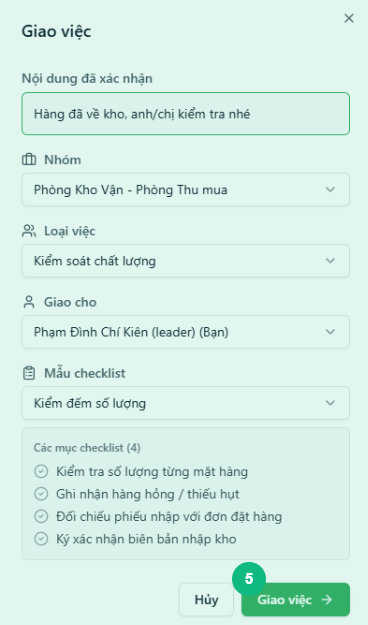

## Khi nào dùng
Khi bạn đọc tin nhắn trong nhóm chat và nhận thấy có thông tin cần xử lý — ví dụ nhân viên báo hàng về, thông báo sự cố, hoặc yêu cầu cần theo dõi — nhưng chưa muốn tạo task ngay.

## Điều kiện
- Đã đăng nhập với vai trò Leader hoặc Admin
- Đang xem nhóm chat (không áp dụng cho chat cá nhân)
- Tin nhắn cần tiếp nhận chưa được giao task và chưa được tiếp nhận trước đó

<Callout type="note">
Chức năng **Tiếp nhận thông tin** chỉ hiện với Leader và Admin. Staff không thấy nút này khi hover lên tin nhắn.
</Callout>

## Các bước

### Bước 1 — Di chuyển chuột lên tin nhắn cần tiếp nhận

Di chuyển chuột lên tin nhắn bất kỳ trong nhóm chat. Thanh công cụ nhỏ hiện ra phía trên hoặc bên cạnh tin nhắn.

### Bước 2 — Bấm biểu tượng hộp thư (Tiếp nhận thông tin)

Bấm vào biểu tượng **hộp thư** trong thanh công cụ. Hệ thống xác nhận thông tin và gửi tin nhắn hệ thống vào nhóm chat để mọi người biết ai đã tiếp nhận.

<Callout type="tip">
Sau khi tiếp nhận, dòng **"📎 Đã tiếp nhận bởi [tên bạn]"** xuất hiện ngay bên dưới tin nhắn đó. Đây là dấu hiệu cho nhân viên biết thông tin đã được ghi nhận.
</Callout>

### Bước 3 — Mở bảng bên phải, chọn tab Công Việc

Bấm nút mở bảng bên phải (nếu chưa mở), rồi bấm tab **Công Việc**. Mục **Thông tin đã tiếp nhận** xuất hiện với số lượng thông tin đang chờ xử lý.

### Bước 4 — Bấm Giao việc để xử lý thông tin

Tìm thẻ thông tin vừa tiếp nhận và bấm nút **Giao việc**. Cửa sổ giao việc mở ra với nội dung đã được điền sẵn từ tin nhắn gốc.

### Bước 5 — Chọn nhóm, loại việc và người nhận rồi xác nhận

Chọn **Nhóm** đích, **Loại việc**, và **người được giao**. Bấm **Giao việc** để tạo task và chuyển thông tin sang nhóm tương ứng.

## Kết quả mong đợi
Thông tin được giao thành công: task mới xuất hiện trong nhóm nhận, thẻ thông tin trong bảng bên phải hiển thị trạng thái **"Đã chuyển sang nhóm"** hoặc **"Đã giao task"**, và dòng tiếp nhận bên dưới tin nhắn gốc vẫn còn để lưu lại dấu vết.

## Lỗi thường gặp

| Lỗi | Nguyên nhân | Cách xử lý |
|-----|-------------|------------|
| Không thấy biểu tượng hộp thư khi hover | Tin nhắn đã được tiếp nhận hoặc đã có task | Kiểm tra dòng "📎 Đã tiếp nhận" bên dưới tin nhắn hoặc xem tab Công Việc |
| Không thấy biểu tượng hộp thư dù là Leader | Đang hover lên tin nhắn hệ thống (màu xám) | Chỉ tiếp nhận được tin nhắn thường, không tiếp nhận tin nhắn hệ thống |
| Mục "Thông tin đã tiếp nhận" không xuất hiện | Chưa có thông tin nào được tiếp nhận | Thực hiện lại Bước 1–2 trước |
| Không chọn được người nhận khi giao việc | Người đó không thuộc nhóm đích | Chọn nhóm khác hoặc liên hệ Admin để thêm thành viên |

## Bài liên quan
- [Cách vào nhóm chat và gửi tin nhắn](/web/chat-nhom)
- [Cách tạo task mới](/web/12-leader-tao-task)
- [Tổng quan tab Công Việc theo Loại Việc](/web/11-leader-tong-quan-cong-viec)

---

*Cập nhật lần cuối: 2026-03-25 — Phiên bản ứng dụng: 1.0.0*
