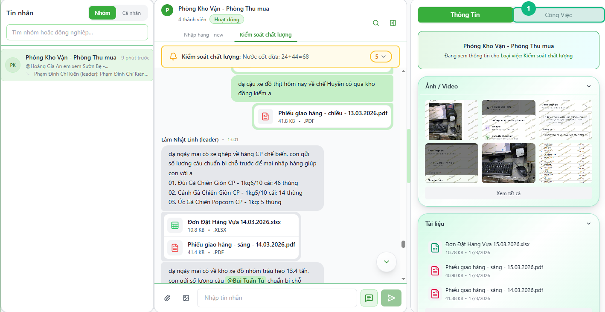
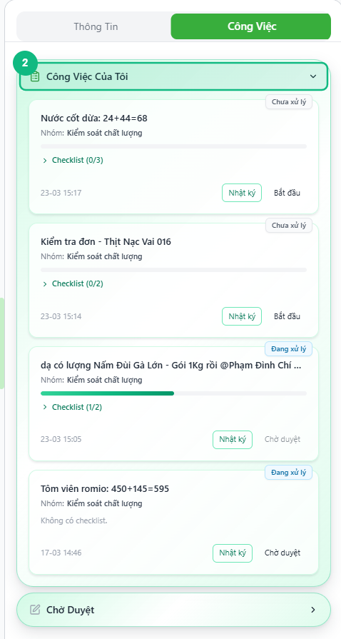
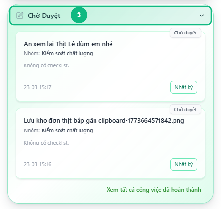
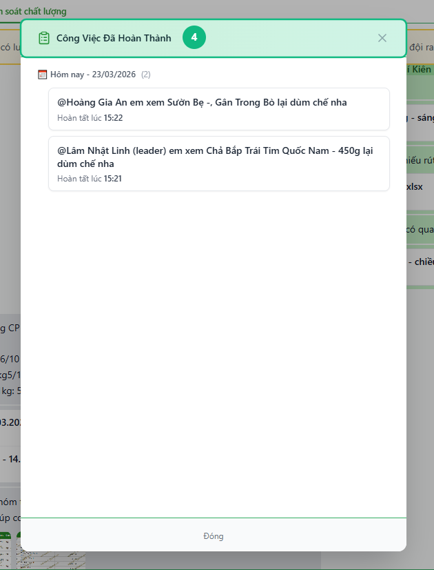

## Khi nào dùng
Khi bạn muốn xem tất cả công việc đang được giao cho mình — bao gồm việc chưa bắt đầu, đang xử lý, đang chờ leader duyệt, và lịch sử đã hoàn thành.

## Điều kiện
- Đã đăng nhập vào hệ thống
- Đang mở một nhóm chat có công việc được giao cho bạn

<Callout type="note">
Tab **Công Việc** chỉ xuất hiện ở nhóm chat, không có ở hộp thư cá nhân (DM). Nếu bạn tham gia nhiều nhóm, hãy chuyển sang đúng nhóm có công việc cần xem.
</Callout>

## Các bước

### Bước 1 — Bấm tab Công Việc ở bảng bên phải

Sau khi mở nhóm chat, bấm tab **Công Việc** ở bảng bên phải màn hình (cạnh tab **Thông Tin**) để xem danh sách task đang được giao.

### Bước 2 — Xem khu vực "Công Việc Của Tôi"

Khu vực **Công Việc Của Tôi** hiển thị tất cả task đang ở trạng thái **Chưa xử lý** và **Đang xử lý** được giao cho bạn. Mỗi thẻ task gồm: tên công việc (có thể bấm để xem tin nhắn gốc), nhóm, tiến trình checklist, và các nút hành động.

<Callout type="tip">
Huy hiệu trạng thái ở góc trên phải mỗi thẻ cho biết task đang ở bước nào: **Chưa xử lý** (nền vàng) — **Đang xử lý** (nền xanh da trời). Task Đang xử lý có thêm thanh tiến trình xanh lá bên dưới tên để thấy checklist đã làm tới đâu.
</Callout>

### Bước 3 — Xem khu vực "Chờ Duyệt"

Cuộn xuống phần **Chờ Duyệt** để xem các task bạn đã gửi lên và đang chờ leader xác nhận. Task ở đây chỉ có nút **Nhật ký** — bạn không thể thay đổi gì cho đến khi leader duyệt hoặc trả lại.

### Bước 4 — Bấm "Xem tất cả công việc đã hoàn thành" để xem lịch sử

Bấm dòng chữ xanh **Xem tất cả công việc đã hoàn thành** ở cuối khu vực Chờ Duyệt. Cửa sổ bật ra liệt kê toàn bộ task đã hoàn tất, nhóm theo ngày và hiển thị giờ hoàn tất của từng việc.

## Kết quả mong đợi
Bạn nắm được toàn bộ trạng thái công việc của mình trong nhóm: số lượng việc đang làm, việc đang chờ duyệt, và lịch sử những việc đã xong.

## Lỗi thường gặp

| Lỗi | Nguyên nhân | Cách xử lý |
|-----|-------------|------------|
| Không thấy tab "Công Việc" | Đang mở chat cá nhân (DM), không phải nhóm | Chuyển sang nhóm chat — tab Công Việc chỉ hiện với nhóm |
| Khu vực "Công Việc Của Tôi" trống, hiện "Không có việc cần làm" | Chưa có task nào được giao cho bạn trong nhóm này | Liên hệ leader để được giao việc, hoặc chuyển sang nhóm khác |
| Tên công việc bị xám, không bấm được | Task được tạo thủ công, không xuất phát từ tin nhắn | Bình thường — bấm nút **Nhật ký** để xem lịch sử thay thế |
| Bấm "Xem tất cả công việc đã hoàn thành" nhưng danh sách trống | Chưa có task nào hoàn tất trong nhóm này | Bình thường nếu bạn chưa hoàn thành task nào |

## Bài liên quan
- [Cách bắt đầu xử lý task](/web/staff-bat-dau-xu-ly)
- [Cách tick checklist và lưu tiến độ](/web/staff-checklist)
- [Cách gửi chờ duyệt](/web/staff-gui-cho-duyet)

---

*Cập nhật lần cuối: 2026-03-25 — Phiên bản ứng dụng: 1.0.0*
