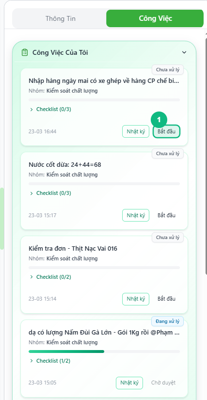
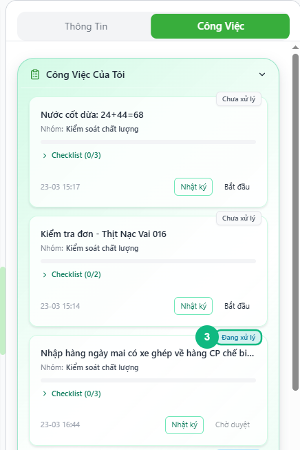
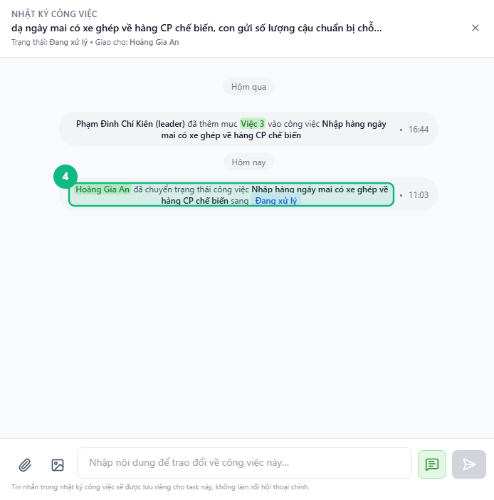

## Khi nào dùng
Khi bạn được giao một công việc có trạng thái **Chưa xử lý** và sẵn sàng bắt tay vào làm — bấm Bắt đầu để hệ thống ghi nhận và chuyển việc sang trạng thái **Đang xử lý**.

## Điều kiện
- Đã đăng nhập vào hệ thống
- Đang mở nhóm chat và xem tab **Công Việc**
- Có ít nhất một task ở trạng thái **Chưa xử lý** trong mục Công Việc Của Tôi

<Callout type="note">
Chỉ bắt đầu task khi bạn thực sự sẵn sàng xử lý. Hệ thống ghi lại thời điểm chuyển trạng thái vào nhật ký công việc để Leader theo dõi.
</Callout>

## Các bước

### Bước 1 — Tìm task Chưa xử lý cần làm

Trong tab **Công Việc**, tìm thẻ task có badge **Chưa xử lý** (nền vàng) ở góc phải trên. Đọc tên task để xác nhận đúng việc cần làm.

<Callout type="tip">
Bấm vào **tên task** (chữ đậm, có gạch chân khi rê chuột) để xem lại tin nhắn gốc mà Leader đã giao — giúp bạn hiểu đúng yêu cầu trước khi bắt đầu.
</Callout>

### Bước 2 — Bấm nút Bắt đầu
Bấm nút **Bắt đầu** ở góc phải dưới thẻ task. Nút sẽ hiển thị vòng tròn xoay trong giây lát khi hệ thống đang lưu.

### Bước 3 — Xác nhận task đã chuyển sang Đang xử lý

Badge của task đổi thành **Đang xử lý** (nền xanh dương nhạt). Nút **Bắt đầu** biến mất, thay bằng nút **Chờ duyệt**. Hệ thống tự động gửi một tin nhắn hệ thống vào nhật ký công việc để ghi lại thay đổi này.

### Bước 4 — Kiểm tra nhật ký công việc (tuỳ chọn)

Bấm nút **Nhật ký** trên thẻ task để mở panel nhật ký. Bạn thấy dòng hệ thống ghi "_[Tên bạn] đã chuyển trạng thái công việc [tên task] sang Đang xử lý_". Tại đây bạn cũng có thể nhắn tin trao đổi thêm về công việc này mà không làm rối khung chat chính.

## Kết quả mong đợi
Task chuyển từ **Chưa xử lý** → **Đang xử lý**. Nếu task có checklist, các ô tick lúc này mới cho phép bấm chọn. Leader nhìn thấy trạng thái cập nhật ngay lập tức.

## Lỗi thường gặp

| Lỗi | Nguyên nhân | Cách xử lý |
|-----|-------------|------------|
| Nút Bắt đầu không hiện | Task không thuộc quyền của bạn, hoặc đã ở trạng thái khác | Kiểm tra lại task — nếu badge không phải Chưa xử lý thì không cần bắt đầu nữa |
| Bấm Bắt đầu không có phản hồi, trạng thái không đổi | Mất kết nối mạng | Kiểm tra mạng rồi bấm lại — nút sẽ bật xoay khi đang xử lý |
| Task biến mất khỏi mục Công Việc Của Tôi sau khi bấm | Leader đã giao việc đó cho người khác | Liên hệ Leader để xác nhận |

## Bài liên quan
- [Cách xem tổng quan công việc của tôi](/web/staff-tong-quan)
- [Cách tick checklist và lưu tiến độ](/web/staff-checklist)
- [Cách gửi Chờ duyệt](/web/staff-gui-cho-duyet)

---

*Cập nhật lần cuối: 2026-03-23 — Phiên bản ứng dụng: 1.0.0*
