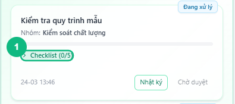
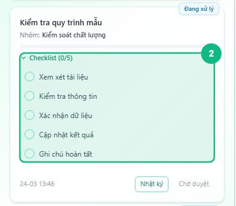
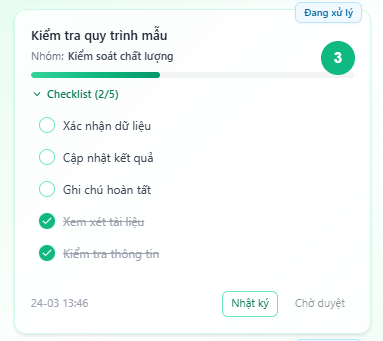
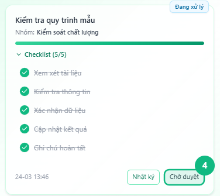

## Khi nào dùng
Khi bạn đang xử lý một task có danh sách bước cần hoàn thành (checklist), tick từng mục sau khi làm xong để hệ thống lưu tiến độ và mở khóa nút **Chờ duyệt**.

## Điều kiện
- Task đang ở trạng thái **Đang xử lý** — checklist chỉ tick được khi task đã bắt đầu
- Task có ít nhất một mục checklist do Leader tạo sẵn

<Callout type="warning">
Khi task đang ở trạng thái **Chưa xử lý** hoặc **Chờ duyệt**, các ô tick sẽ bị mờ và không thể bấm. Cần bấm **Bắt đầu** trước để mở khóa checklist.
</Callout>

## Các bước

### Bước 1 — Mở rộng checklist trên thẻ task

Tìm thẻ task **Đang xử lý** trong mục Công Việc Của Tôi. Bấm vào dòng **Checklist (X/Y)** để mở rộng danh sách các mục bên dưới.

<Callout type="tip">
Thanh tiến trình màu xanh ngay dưới tên task cho thấy phần trăm hoàn thành. Bấm vào dòng Checklist để xem chi tiết từng mục.
</Callout>

### Bước 2 — Tick một mục đã hoàn thành

Bấm vào **ô tròn** bên trái hoặc **tên mục** để đánh dấu hoàn thành. Ô tròn chuyển màu xanh lá, tên mục có gạch ngang, và hệ thống tự lưu ngay — không cần bấm thêm nút nào.

### Bước 3 — Kiểm tra thanh tiến trình cập nhật

Sau mỗi lần tick, thanh tiến trình phía trên cập nhật ngay. Tiếp tục tick các mục còn lại theo thứ tự công việc thực tế. Các mục **chưa tick** luôn hiển thị trên cùng, mục **đã tick** xuống dưới.

### Bước 4 — Hoàn thành toàn bộ checklist để mở khóa nút Chờ duyệt

Khi tất cả mục đã được tick, thanh tiến trình hiển thị **100%** và nút **Chờ duyệt** ở góc phải dưới thẻ task sáng lên, sẵn sàng bấm.

<Callout type="note">
Nếu chưa tick hết checklist, nút **Chờ duyệt** bị mờ và hiện tooltip _"Vui lòng hoàn thành tất cả checklist items trước"_ khi rê chuột vào.
</Callout>

## Kết quả mong đợi
Từng mục checklist được lưu ngay sau khi tick. Khi tick đủ 100%, nút **Chờ duyệt** sáng lên để bạn chuyển task sang bước tiếp theo. Mỗi lần tick cũng tạo một dòng ghi chú trong nhật ký công việc để Leader theo dõi tiến độ.

## Lỗi thường gặp

| Lỗi | Nguyên nhân | Cách xử lý |
|-----|-------------|------------|
| Ô tick bị mờ, bấm không có phản hồi | Task chưa ở trạng thái Đang xử lý | Bấm nút **Bắt đầu** trên thẻ task trước |
| Bấm tick nhưng trạng thái không đổi | Mất kết nối mạng | Kiểm tra mạng rồi bấm lại — hệ thống không lưu nháp offline |
| Nút Chờ duyệt vẫn mờ dù tick đủ các mục thấy được | Còn mục ẩn chưa tick (mục đã tick xuống cuối danh sách) | Cuộn danh sách checklist xuống để kiểm tra còn mục nào chưa tick |
| Tick nhầm — muốn bỏ tick | Bình thường — hệ thống cho phép bỏ tick | Bấm lại vào ô tròn hoặc tên mục để bỏ dấu tick |

## Bài liên quan
- [Cách bắt đầu xử lý task](/web/staff-bat-dau-xu-ly)
- [Cách gửi Chờ duyệt](/web/staff-gui-cho-duyet)

---

*Cập nhật lần cuối: 2026-03-23 — Phiên bản ứng dụng: 1.0.0*
