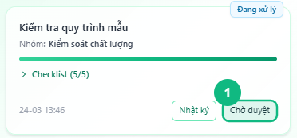
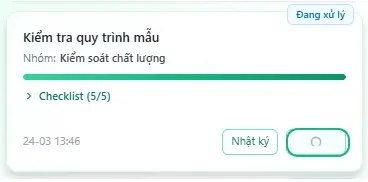
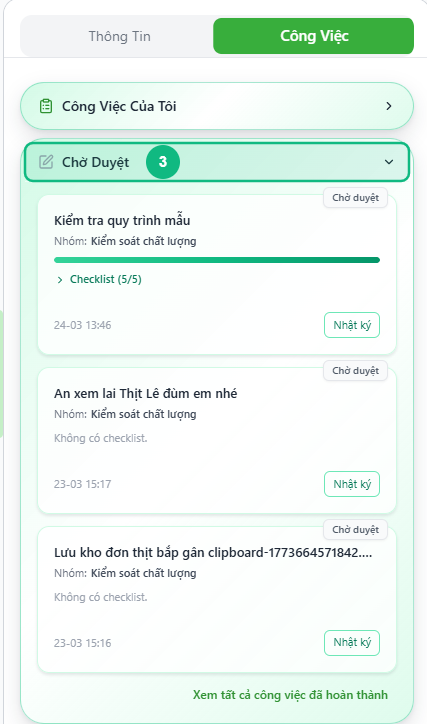

## Khi nào dùng
Khi bạn đã hoàn thành xong công việc và muốn gửi lên cho Leader xác nhận — bấm **Chờ duyệt** để chuyển task sang hàng đợi phê duyệt.

## Điều kiện
- Task đang ở trạng thái **Đang xử lý**
- Nếu task có checklist: tất cả các mục đã được tick đủ

<Callout type="warning">
Nút **Chờ duyệt** sẽ bị mờ nếu còn mục checklist chưa tick. Hoàn thành toàn bộ checklist trước khi gửi duyệt.
</Callout>

## Các bước

### Bước 1 — Tìm task Đang xử lý đã sẵn sàng gửi duyệt

Trong mục **Công Việc Của Tôi**, tìm thẻ task có badge **Đang xử lý**. Kiểm tra thanh tiến trình checklist đã đạt **100%** (nếu có checklist) và nút **Chờ duyệt** đang sáng — không bị mờ.

### Bước 2 — Bấm nút Chờ duyệt

Bấm nút **Chờ duyệt** ở góc phải dưới thẻ task. Nút hiển thị vòng tròn xoay trong giây lát khi hệ thống đang lưu.

### Bước 3 — Xác nhận task đã chuyển sang mục Chờ Duyệt

Task biến mất khỏi mục **Công Việc Của Tôi** và xuất hiện trong mục **Chờ Duyệt** phía dưới. Badge đổi thành **Chờ duyệt** (nền cam nhạt). Lúc này tất cả các nút hành động đều biến mất — chỉ còn nút **Nhật ký**.

<Callout type="note">
Sau khi gửi Chờ duyệt, bạn **không thể tự chỉnh sửa hay rút lại** task. Chỉ Leader mới có thể duyệt hoặc trả lại việc cho bạn.
</Callout>

## Kết quả mong đợi
Task chuyển từ **Đang xử lý** → **Chờ duyệt** và di chuyển xuống mục Chờ Duyệt. Hệ thống tự động gửi một tin nhắn thông báo vào nhật ký công việc. Leader nhìn thấy task trong hàng đợi phê duyệt ngay lập tức.

## Lỗi thường gặp

| Lỗi | Nguyên nhân | Cách xử lý |
|-----|-------------|------------|
| Nút Chờ duyệt bị mờ, không bấm được | Còn mục checklist chưa tick | Mở checklist, tick hết tất cả mục rồi thử lại |
| Bấm Chờ duyệt nhưng không có phản hồi | Mất kết nối mạng | Kiểm tra mạng rồi bấm lại |
| Không thấy nút Chờ duyệt trên thẻ task | Task chưa ở trạng thái Đang xử lý | Kiểm tra badge — nếu là Chưa xử lý, cần bấm Bắt đầu trước |
| Task vẫn nằm ở Công Việc Của Tôi, không chuyển xuống Chờ Duyệt | Trang chưa cập nhật | Đợi 1–2 giây để dữ liệu cập nhật tự động qua kết nối thời gian thực |

## Bài liên quan
- [Cách bắt đầu xử lý task](/web/staff-bat-dau-xu-ly)
- [Cách tick checklist và lưu tiến độ](/web/staff-checklist)
- [Cách xem tổng quan công việc của tôi](/web/staff-tong-quan)

---

*Cập nhật lần cuối: 2026-03-23 — Phiên bản ứng dụng: 1.0.0*
