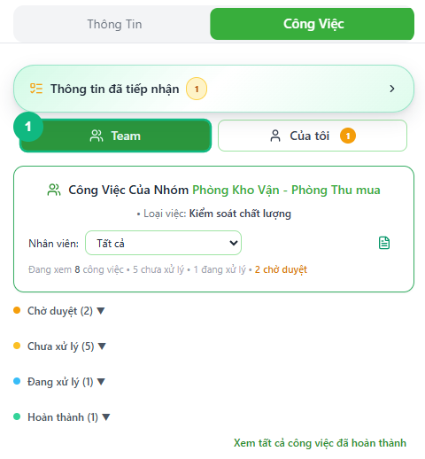
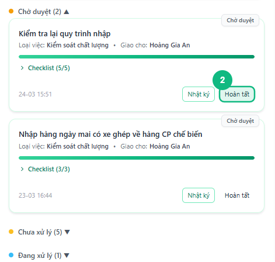
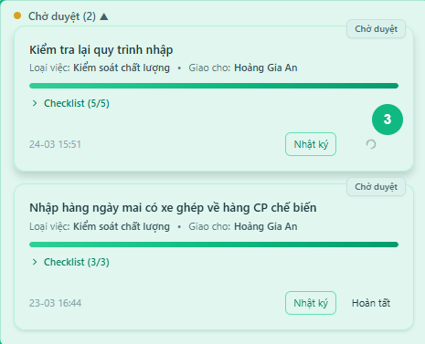
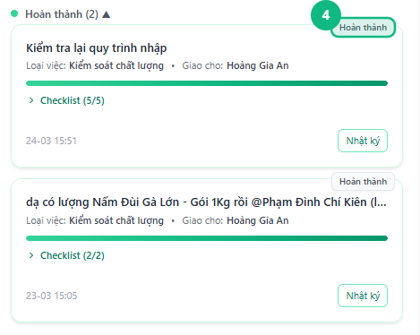

## Khi nào dùng
Khi nhân viên đã hoàn thành công việc và bấm **Chờ duyệt**, thẻ công việc sẽ chuyển sang hàng đợi cần xác nhận. Leader dùng tính năng này để kiểm tra lại và xác nhận hoàn tất.

## Điều kiện
- Đã đăng nhập với vai trò Leader hoặc Admin
- Đang mở nhóm chat có ít nhất một công việc ở trạng thái **Chờ duyệt**
- Đang ở tab **Công Việc** trong bảng bên phải, chế độ hiển thị **Nhóm**

<Callout type="note">
Nút **Hoàn tất** chỉ xuất hiện trên thẻ công việc **Chờ duyệt** khi bạn đăng nhập bằng tài khoản Leader hoặc Admin. Nhân viên không thấy nút này.
</Callout>

## Các bước

### Bước 1 — Bấm nút Nhóm để xem công việc toàn nhóm

Trong tab **Công Việc** ở bảng bên phải, bấm nút **Nhóm** (nút bên trái trong cặp nút chuyển chế độ). Phần thống kê phía dưới hiển thị số lượng công việc đang chờ duyệt, tô đậm màu cam để dễ nhận biết.

### Bước 2 — Bấm vào tiêu đề "Chờ duyệt" để mở danh sách

Bấm vào dòng tiêu đề **Chờ duyệt (N)** ở đầu danh sách công việc — dấu ▼ chuyển thành ▲ và các thẻ công việc cần duyệt hiện ra bên dưới. Mỗi thẻ cho thấy tên công việc, người thực hiện, và nút **Hoàn tất** ở góc dưới bên phải.

<Callout type="tip">
Bấm **Nhật ký** trên thẻ để xem lại toàn bộ quá trình làm việc của nhân viên — checklist đã tick, ảnh đã gửi, ghi chú — trước khi quyết định duyệt hay không.
</Callout>

### Bước 3 — Bấm Hoàn tất trên thẻ công việc cần duyệt

Tìm thẻ công việc cần duyệt và bấm nút **Hoàn tất**. Hệ thống cập nhật trạng thái, gửi tin nhắn thông báo vào luồng chat của công việc đó, và thẻ tự động biến khỏi hàng **Chờ duyệt**.

### Bước 4 — Kiểm tra kết quả trong phần "Hoàn thành hôm nay"

Cuộn xuống phần **Hoàn thành hôm nay** để xác nhận thẻ vừa duyệt đã xuất hiện ở đó. Số lượng chờ duyệt trong tiêu đề giảm đi đúng 1.

## Kết quả mong đợi
Thẻ công việc chuyển từ **Chờ duyệt** sang **Hoàn thành**. Nhân viên nhận được thông báo trong nhóm chat. Số chờ duyệt trong phần thống kê giảm xuống.

## Lỗi thường gặp

| Lỗi | Nguyên nhân | Cách xử lý |
|-----|-------------|------------|
| Nút **Hoàn tất** bị mờ, không bấm được | Checklist chưa tick đủ tất cả các mục | Bấm **Nhật ký** để xem mục nào còn thiếu, liên hệ nhân viên hoàn thiện rồi duyệt lại |
| Không thấy phần **Chờ duyệt** hoặc danh sách trống | Chưa chọn Loại việc ở phần tiêu đề bảng, hoặc chưa có công việc nào gửi chờ | Chọn đúng Loại việc trong phần đầu tab Công Việc |
| Không thấy nút **Hoàn tất**, chỉ thấy nút **Chờ duyệt** | Đang đăng nhập bằng tài khoản nhân viên | Nút Hoàn tất chỉ hiện với Leader và Admin |
| Bấm **Hoàn tất** nhưng thẻ không biến mất | Kết nối mạng chậm | Chờ biểu tượng xoay trên nút tắt hẳn rồi cuộn lại để kiểm tra |

## Bài liên quan
- [Mở Nhật ký công việc](../23-mo-nhat-ky)
- [Xem lại công việc đã hoàn tất](/web/xem-task-hoan-tat)
- [Leader: Chuyển trạng thái công việc](/web/leader-chuyen-trang-thai)

---

*Cập nhật lần cuối: 2026-03-25 — Phiên bản ứng dụng: 1.0.0*
