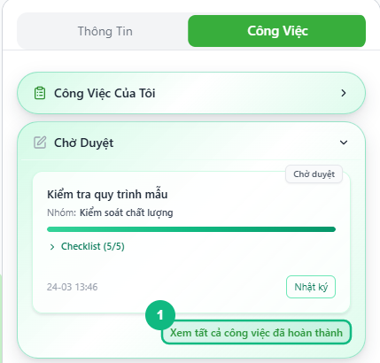
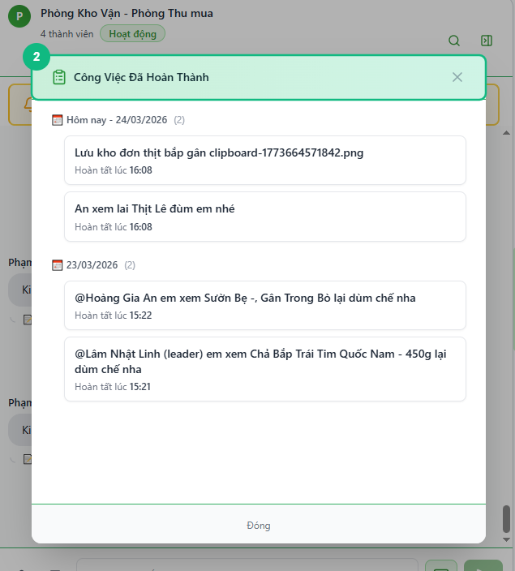
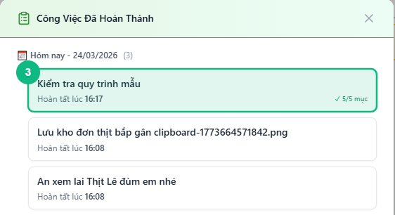
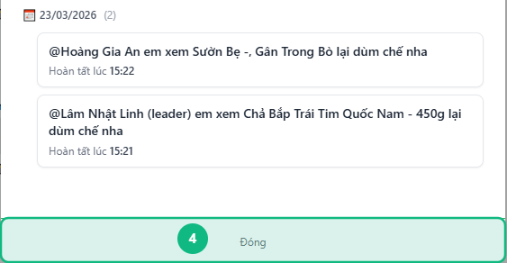

## Khi nào dùng
Khi bạn muốn xem lại toàn bộ công việc đã hoàn tất — theo dõi lịch sử, kiểm tra tiến độ đã làm được, hoặc tra cứu task hoàn thành vào ngày cụ thể.

## Điều kiện
- Đã đăng nhập vào hệ thống
- Đang mở nhóm chat có Loại Việc và tab **Công Việc**
- Đã có ít nhất một task ở trạng thái **Hoàn thành** được giao cho bạn

<Callout type="note">
Danh sách này chỉ hiển thị task **Hoàn thành của chính bạn** — không hiển thị task của người khác trong nhóm. Leader muốn xem task đã duyệt của cả nhóm thì dùng tab **Team** trong chế độ Leader.
</Callout>

## Các bước

### Bước 1 — Mở tab Công Việc và cuộn xuống mục Chờ Duyệt

Bấm tab **Công Việc** ở cột phải. Cuộn xuống để thấy mục **Chờ Duyệt** — ngay cuối mục này có nút chữ nhỏ màu xanh **"Xem tất cả công việc đã hoàn thành"**.

<Callout type="tip">
Leader xem task hoàn thành của bản thân theo cách khác: bấm tab **Công Việc** → chọn **Của tôi** trên thanh chuyển đổi → cuộn xuống cuối danh sách. Nút "Xem tất cả công việc đã hoàn thành (N →)" xuất hiện khi có task đã xong.
</Callout>

### Bước 2 — Bấm "Xem tất cả công việc đã hoàn thành"

Bấm vào nút chữ nhỏ **"Xem tất cả công việc đã hoàn thành"**. Một cửa sổ bật lên (modal) hiển thị danh sách đầy đủ các task đã hoàn tất, được nhóm theo ngày hoàn thành.

### Bước 3 — Xem chi tiết từng task trong modal

Mỗi thẻ task hiển thị: tên công việc, giờ hoàn tất, số mục checklist đã tick (nếu có) và Loại Việc. Các task gần nhất nằm trên cùng, nhóm theo ngày theo thứ tự mới → cũ.

### Bước 4 — Đóng modal khi xem xong

Bấm nút **Đóng** ở cuối modal hoặc bấm nút **✕** ở góc phải trên để đóng và quay về tab Công Việc.

## Kết quả mong đợi
Bạn xem được toàn bộ lịch sử task đã hoàn thành, nhóm theo từng ngày. Task hoàn thành hôm nay hiển thị đầu tiên với nhãn **"Hôm nay - DD/MM/YYYY"**.

## Lỗi thường gặp

| Lỗi | Nguyên nhân | Cách xử lý |
|-----|-------------|------------|
| Modal mở ra nhưng hiện "Chưa có công việc nào hoàn thành" | Chưa có task nào ở trạng thái Hoàn thành được giao cho bạn | Bình thường — danh sách sẽ có dữ liệu sau khi Leader duyệt task của bạn |
| Không thấy nút "Xem tất cả công việc đã hoàn thành" | Trang đang tải dữ liệu, nút bị thay thành "Đang tải…" | Đợi vài giây rồi thử lại |
| Task đã Leader duyệt nhưng không xuất hiện trong danh sách | Task được giao cho thành viên khác, không phải bạn | Đúng hành vi — danh sách chỉ hiển thị task của chính mình |

## Bài liên quan
- [Cách xem tổng quan công việc của tôi](/web/staff-tong-quan)
- [Cách gửi Chờ duyệt](/web/staff-gui-cho-duyet)

---

*Cập nhật lần cuối: 2026-03-23 — Phiên bản ứng dụng: 1.0.0*
