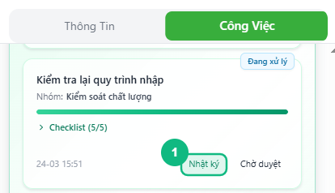
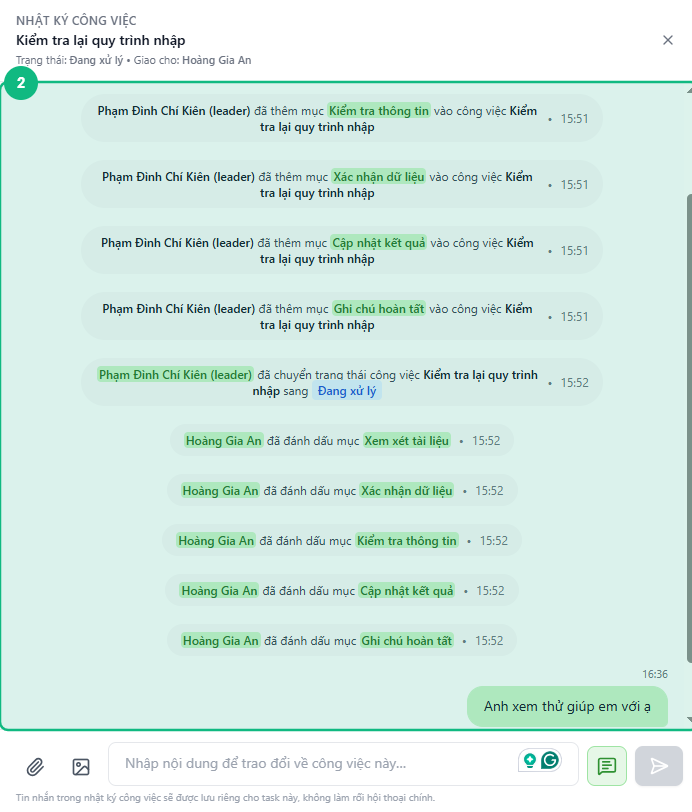
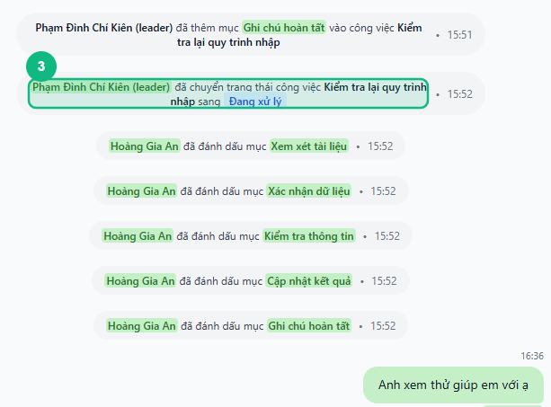
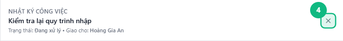

## Khi nào dùng
Khi bạn muốn xem lịch sử thay đổi trạng thái của một task, đọc lại trao đổi giữa các thành viên về công việc đó, hoặc hỏi thêm thông tin mà không muốn làm rối khung chat chính của nhóm.

## Điều kiện
- Đang mở nhóm chat và xem tab **Công Việc**
- Có ít nhất một thẻ task hiển thị trong bất kỳ mục nào (Công Việc Của Tôi, Chờ Duyệt, hoặc các mục trong chế độ Leader)

<Callout type="note">
Nhật ký công việc hoạt động như một luồng chat riêng — gắn liền với từng task. Tin nhắn trong nhật ký **không hiện** ra khung chat chính của nhóm.
</Callout>

## Các bước

### Bước 1 — Tìm thẻ task và bấm nút Nhật ký

Trên bất kỳ thẻ task nào, bấm nút **Nhật ký** ở hàng nút phía dưới thẻ. Nút có viền xanh lá, luôn hiển thị dù task đang ở trạng thái nào.

### Bước 2 — Panel Nhật ký mở ra bên phải

Panel **Nhật ký công việc** trượt lên phủ lên màn hình. Header hiển thị tên task, trạng thái hiện tại và người được giao. Nội dung trong panel là toàn bộ lịch sử trao đổi và các dòng hệ thống ghi lại thay đổi trạng thái.

### Bước 3 — Đọc tin nhắn hệ thống và trao đổi của nhóm

Tin nhắn hệ thống (dạng pill xám căn giữa) ghi lại mỗi lần trạng thái task thay đổi. Tin nhắn thường (bubble trái/phải) là trao đổi giữa các thành viên. Tất cả được nhóm theo ngày bằng đường phân cách có nhãn ngày.

### Bước 4 — Đóng panel khi xem xong

Bấm nút **✕** ở góc phải trên header panel để đóng và quay về tab Công Việc. Panel đóng không mất dữ liệu — mở lại bất cứ lúc nào vẫn thấy đủ lịch sử.

## Kết quả mong đợi
Panel Nhật ký mở ra và hiển thị đầy đủ lịch sử trao đổi của task đó. Nếu task chưa có trao đổi nào, panel hiển thị thông báo _"Chưa có trao đổi nào trong nhật ký công việc này. Hãy gửi tin nhắn đầu tiên để bắt đầu trao đổi."_

## Lỗi thường gặp

| Lỗi | Nguyên nhân | Cách xử lý |
|-----|-------------|------------|
| Bấm Nhật ký nhưng panel không mở | Mất kết nối mạng, trang chưa kịp tải | Kiểm tra mạng rồi bấm lại |
| Panel mở ra nhưng hiện icon xoay mãi không dứt | Đang tải dữ liệu từ server | Đợi 2–3 giây, nếu vẫn lỗi thì đóng và mở lại |
| Không thấy nút Nhật ký trên thẻ task | Đang xem giao diện khác (không phải tab Công Việc) | Bấm tab Công Việc ở cột phải để về đúng chỗ |

## Bài liên quan
- [Cách thêm log và trao đổi trong Nhật ký](/web/them-log-nhat-ky)
- [Cách bắt đầu xử lý task](/web/staff-bat-dau-xu-ly)
- [Cách gửi Chờ duyệt](/web/staff-gui-cho-duyet)

---

*Cập nhật lần cuối: 2026-03-24 — Phiên bản ứng dụng: 1.0.0*
