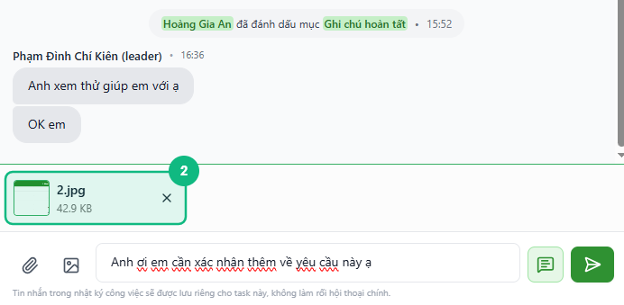
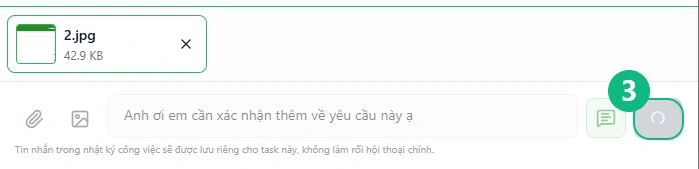
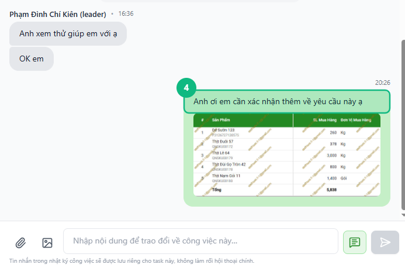

## Khi nào dùng
Khi bạn muốn ghi lại tiến độ, hỏi thêm thông tin, hoặc trao đổi về một task cụ thể — mà không muốn làm rối khung chat chính của nhóm.

## Điều kiện
- Đã mở panel **Nhật ký** của task cần trao đổi (xem [Cách mở Nhật ký công việc](../23-mo-nhat-ky))

<Callout type="note">
Tin nhắn trong Nhật ký được lưu riêng cho từng task — chỉ hiện trong panel Nhật ký, không xuất hiện ở khung chat chính của nhóm.
</Callout>

## Các bước

### Bước 1 — Gõ nội dung vào ô soạn thảo

Bấm vào ô soạn thảo ở dưới cùng panel (nơi hiện dòng chữ mờ _"Nhập nội dung để trao đổi về công việc này…"_) rồi gõ nội dung cần gửi. Nút Gửi sáng lên ngay khi có chữ trong ô.

<Callout type="tip">
Gõ **@** rồi tên thành viên để gắn tên người đó vào tin nhắn — họ sẽ nhận được thông báo ngay cả khi không mở nhật ký.
</Callout>

### Bước 2 — Đính kèm tệp hoặc ảnh (nếu cần)

Bấm nút **kẹp ghim** (📎) để đính kèm tài liệu, hoặc nút **hình ảnh** (🖼️) để chọn ảnh. Tệp đã chọn sẽ hiện ra ô xem trước ngay bên trên ô soạn thảo — bấm dấu **✕** trên từng tệp nếu muốn bỏ.

<Callout type="note">
Định dạng tệp được hỗ trợ: PDF, Word, Excel, ảnh (JPG, PNG, WEBP), video (MP4). Tối đa nhiều tệp trong một lần gửi.
</Callout>

### Bước 3 — Bấm nút Gửi hoặc nhấn phím Enter

Bấm nút **Gửi** (mũi tên →) ở góc phải ô soạn thảo, hoặc nhấn **Enter** trên bàn phím. Nút hiện vòng tròn xoay trong giây lát khi tin nhắn đang được gửi đi.

### Bước 4 — Xác nhận tin nhắn xuất hiện trong luồng

Tin nhắn của bạn xuất hiện ở **bên phải** luồng. Ô soạn thảo tự xoá trắng, sẵn sàng cho lần nhập tiếp theo.

## Kết quả mong đợi
Tin nhắn được lưu vào Nhật ký của task, hiển thị ngay trong luồng. Các thành viên khác mở Nhật ký sẽ thấy tin nhắn của bạn. Nếu bạn có gắn tên ai bằng @, người đó nhận thông báo ngay lập tức.

## Lỗi thường gặp

| Lỗi | Nguyên nhân | Cách xử lý |
|-----|-------------|------------|
| Bấm Gửi nhưng không thấy tin nhắn xuất hiện | Mất kết nối mạng | Kiểm tra mạng rồi bấm Gửi lại |
| Nút Gửi bị mờ, không bấm được | Ô soạn thảo trống và chưa có tệp đính kèm | Nhập nội dung hoặc chọn ít nhất một tệp trước |
| Gắn tên nhưng người đó không nhận thông báo | Gõ tên tự do thay vì chọn từ danh sách gợi ý | Gõ **@** rồi chọn tên từ danh sách bật lên — không gõ tay toàn bộ tên |
| Tệp đính kèm báo lỗi không tải được | Định dạng tệp không được hỗ trợ hoặc tệp quá lớn | Kiểm tra định dạng và dung lượng tệp |

## Bài liên quan
- [Cách mở Nhật ký công việc](/web/mo-nhat-ky)
- [Cách gửi ảnh và video trong Nhật ký](/web/gui-anh-video-nhat-ky)
- [Cách gửi Chờ duyệt](/web/staff-gui-cho-duyet)

---

*Cập nhật lần cuối: 2026-03-24 — Phiên bản ứng dụng: 1.0.0*
