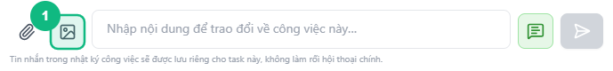
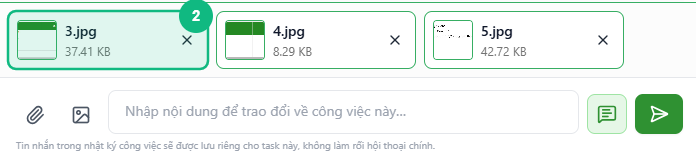
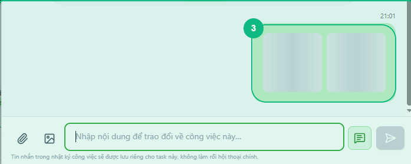
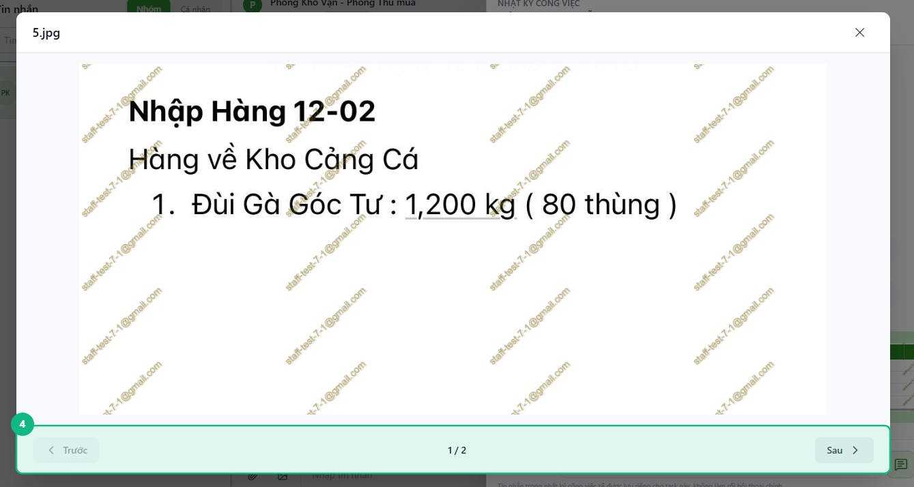

## Khi nào dùng
Khi bạn cần gửi ảnh chụp màn hình, ảnh tài liệu, hoặc video ngắn vào Nhật ký của một task — ví dụ: gửi bằng chứng hoàn thành, ảnh lỗi cần xác nhận, hoặc đoạn ghi hình minh hoạ.

## Điều kiện
- Đã mở panel **Nhật ký** của task cần gửi (xem [Cách mở Nhật ký công việc](../23-mo-nhat-ky))
- Ảnh hoặc video đã có sẵn trên máy tính

<Callout type="note">
Định dạng ảnh được hỗ trợ: JPG, PNG, GIF, WEBP. Định dạng video được hỗ trợ: MP4. Dung lượng tối đa mỗi tệp là **10 MB**. Tối đa **10 tệp** trong một lần gửi.
</Callout>

## Các bước

### Bước 1 — Bấm nút hình ảnh để mở hộp chọn tệp

Trong thanh soạn tin ở dưới cùng panel Nhật ký, bấm nút **hình ảnh** (biểu tượng 🖼️ — ngay bên phải nút kẹp ghim). Hộp chọn tệp của máy tính bật lên, chỉ hiển thị các tệp ảnh.

<Callout type="tip">
Muốn gửi **video MP4**: dùng nút **kẹp ghim** (📎) thay vì nút hình ảnh — vì nút hình ảnh chỉ chấp nhận ảnh. Sau khi chọn, video hiển thị ảnh thu nhỏ với biểu tượng ▶ ở giữa.
</Callout>

### Bước 2 — Chọn ảnh và xem ô xem trước

Chọn một hoặc nhiều ảnh trong hộp chọn tệp rồi bấm **Mở**. Mỗi ảnh xuất hiện dưới dạng ảnh thu nhỏ trong ô xem trước bên trên thanh soạn tin — bấm **✕** trên từng ảnh để bỏ nếu chọn nhầm.

### Bước 3 — Bấm nút Gửi

Bấm nút **Gửi** (mũi tên →) hoặc nhấn **Enter**. Thanh tiến trình xuất hiện bên dưới mỗi ảnh trong ô xem trước, hiển thị phần trăm đang tải lên. Khi tải xong, ảnh tự biến khỏi ô xem trước và xuất hiện trong luồng.

### Bước 4 — Xem ảnh trong luồng và bấm phóng to

Ảnh vừa gửi xuất hiện trong luồng dưới dạng ảnh thu nhỏ. Bấm vào **bất kỳ ảnh nào** để mở cửa sổ xem phóng to. Nếu tin nhắn có nhiều ảnh, dùng nút **◀ Trước** và **Sau ▶** ở cuối cửa sổ để điều hướng qua từng ảnh.

<Callout type="tip">
Trong cửa sổ phóng to, nhấn phím **← →** trên bàn phím để chuyển ảnh nhanh hơn. Nhấn **Esc** để đóng.
</Callout>

## Kết quả mong đợi
Ảnh và video được gửi thành công, hiển thị dưới dạng ảnh thu nhỏ trong luồng Nhật ký. Thành viên khác mở Nhật ký cùng task sẽ thấy ngay. Bấm vào ảnh mở cửa sổ phóng to có thể tải xuống (nếu được quyền).

## Lỗi thường gặp

| Lỗi | Nguyên nhân | Cách xử lý |
|-----|-------------|------------|
| Chọn ảnh xong nhưng không thấy ảnh thu nhỏ trong ô xem trước | Định dạng ảnh không được hỗ trợ | Chuyển sang JPG, PNG hoặc WEBP rồi thử lại |
| Thanh tiến trình dừng ở giữa và hiện thông báo lỗi | Ảnh vượt quá 10 MB hoặc mạng bị ngắt | Nén ảnh xuống dưới 10 MB hoặc kiểm tra kết nối rồi thử lại |
| Bấm Gửi nhưng nút bị mờ | Tệp đang trong trạng thái tải lên, chưa xong | Đợi tất cả ảnh tải lên hoàn tất rồi mới bấm Gửi |
| Bấm xem phóng to nhưng hiện "Không thể tải ảnh" | Mạng yếu hoặc phiên đăng nhập hết hạn | Làm mới trang và đăng nhập lại nếu cần |
| Đã chọn 10 ảnh, không thể chọn thêm | Đã đạt giới hạn 10 tệp mỗi lần gửi | Gửi 10 ảnh trước, sau đó gửi thêm trong tin nhắn tiếp theo |

## Bài liên quan
- [Cách thêm log và trao đổi trong Nhật ký](/web/them-log-nhat-ky)
- [Cách mở Nhật ký công việc](/web/mo-nhat-ky)
- [Cách xem hồ sơ tệp gắn với task/chat](/web/xem-ho-so-file)

---

*Cập nhật lần cuối: 2026-03-24 — Phiên bản ứng dụng: 1.0.0*
