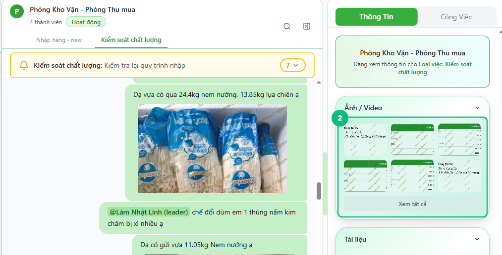
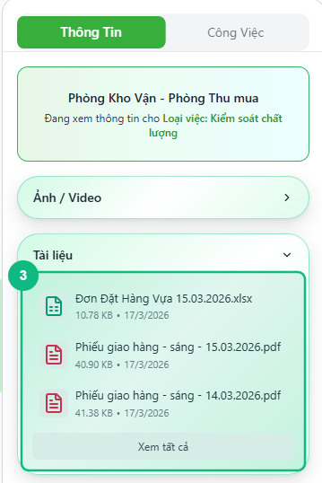
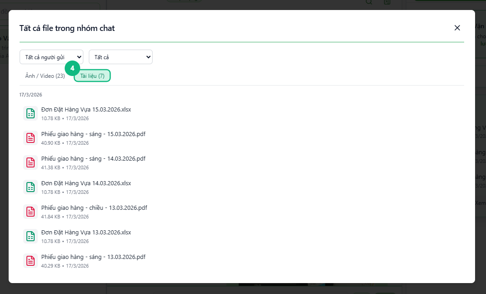

## Khi nào dùng
Khi bạn muốn tra cứu lại một ảnh, video, hoặc tài liệu đã được gửi trong nhóm chat — mà không cần cuộn ngược toàn bộ lịch sử tin nhắn để tìm.

## Điều kiện
- Đang mở một cuộc trò chuyện nhóm (không áp dụng cho nhắn tin cá nhân)
- Đã có ít nhất một tệp đính kèm từng được gửi trong nhóm đó

<Callout type="note">
Tính năng này tổng hợp tất cả tệp từ **lịch sử chat của nhóm**, bao gồm cả tệp trong Nhật ký công việc. Tệp được sắp xếp từ mới nhất đến cũ nhất.
</Callout>

## Các bước

### Bước 1 — Mở bảng thông tin bên phải

Bấm nút **mở bảng thông tin** ở góc trên bên phải khung chat (biểu tượng bảng với mũi tên ◀▶). Bảng **Thông Tin** trượt ra bên phải, hiển thị thông tin nhóm cùng các mục: **Ảnh / Video**, **Tất Cả Tệp**, và **Tài liệu**.

<Callout type="tip">
Nếu bảng đã mở sẵn, bỏ qua bước này và chuyển thẳng sang Bước 2.
</Callout>

### Bước 2 — Xem ảnh/video gần đây trong mục Ảnh / Video

Bảng hiển thị lưới ảnh/video mới nhất (tối đa 6 ảnh). Bấm vào một ảnh để xem phóng to. Nếu muốn xem thêm, bấm nút **Xem tất cả** bên dưới lưới.

### Bước 3 — Xem tài liệu gần đây trong mục Tài liệu

Cuộn xuống bảng để tìm mục **Tài liệu** — hiển thị danh sách tài liệu mới nhất (PDF, Word, Excel, tối đa 3 mục). Bấm vào một tài liệu để xem trước ngay trong cửa sổ bật lên.

### Bước 4 — Mở cửa sổ Tất Cả Tệp để tra cứu toàn bộ

Bấm nút **Xem Tất Cả Tệp** trong mục cùng tên. Cửa sổ **Tất cả tệp** bật lên, có ô phân loại lọc theo tên người gửi, ngày gửi, và danh sách đầy đủ mọi tệp từng được gửi trong nhóm. Bấm **✕** để đóng khi xem xong.

<Callout type="tip">
Dùng ô tìm kiếm trong cửa sổ **Tất cả tệp** để tra nhanh theo tên tệp — tiện hơn nhiều so với cuộn tay qua danh sách dài.
</Callout>

## Kết quả mong đợi
Bạn tra cứu được ảnh, video, hoặc tài liệu đã gửi trong nhóm mà không cần cuộn ngược lịch sử chat. Bấm vào bất kỳ tệp nào để xem trước trực tiếp.

## Lỗi thường gặp

| Lỗi | Nguyên nhân | Cách xử lý |
|-----|-------------|------------|
| Mục Ảnh / Video hoặc Tài liệu hiển thị "Chưa có … nào" | Nhóm chưa có ai gửi tệp loại đó | Bình thường — khi có tệp mới gửi, mục này tự cập nhật |
| Cửa sổ Tất cả tệp hiện "Không tìm thấy file" sau khi tìm kiếm | Từ khoá tìm không khớp với tên tệp nào | Thử rút ngắn từ khoá hoặc xoá bộ lọc |
| Bấm vào ảnh nhưng hiện "Không thể tải ảnh" | Mạng yếu hoặc phiên đăng nhập hết hạn | Kiểm tra kết nối mạng và làm mới trang nếu cần |
| Không thấy nút mở bảng thông tin | Đang mở cuộc trò chuyện cá nhân (nhắn tin 1-1) | Tính năng này chỉ có ở nhóm chat — chuyển sang tab Nhóm |

## Bài liên quan
- [Cách gửi ảnh và video trong Nhật ký](/web/gui-anh-video-nhat-ky)
- [Cách thêm log và trao đổi trong Nhật ký](/web/them-log-nhat-ky)
- [Cách vào nhóm chat và gửi tin nhắn](/web/chat-nhom)

---

*Cập nhật lần cuối: 2026-03-24 — Phiên bản ứng dụng: 1.0.0*
