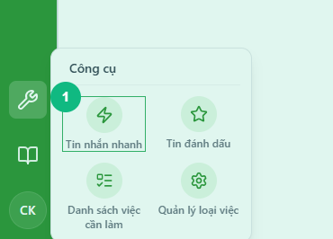
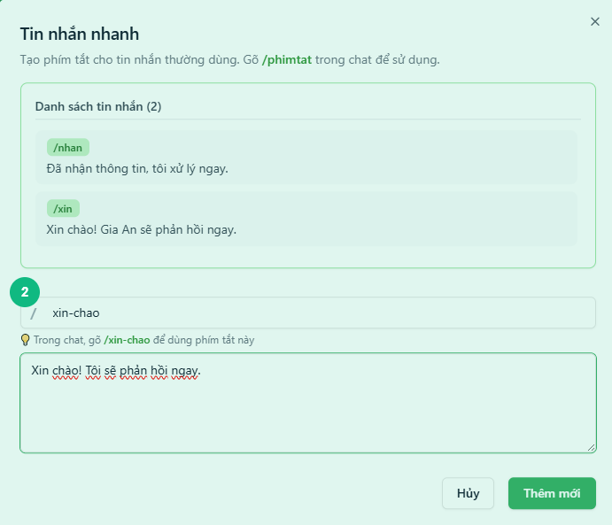
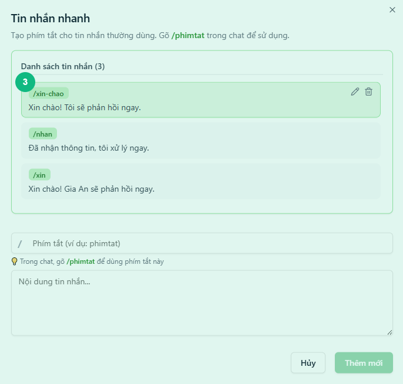
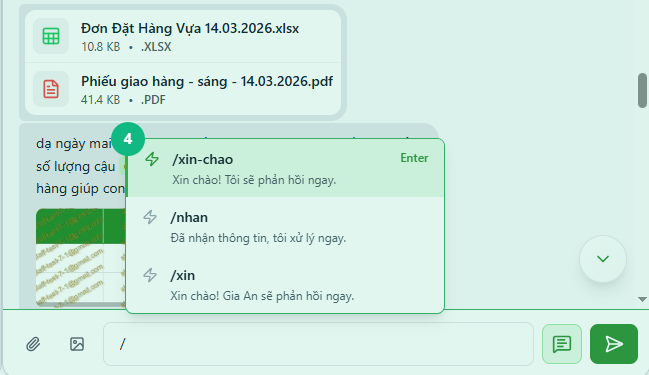

## Khi nào dùng
Khi bạn có những câu trả lời hay lời chào thường xuyên gửi đi trong chat — thay vì gõ lại từ đầu mỗi lần, bạn đặt một phím tắt ngắn và gõ phím tắt đó để tự động điền nội dung đầy đủ vào ô tin nhắn.

## Điều kiện
- Đã đăng nhập vào hệ thống
- Đang ở màn hình chính (có thanh công cụ bên trái)

<Callout type="note">
Tin nhắn mẫu là **riêng của từng người** — chỉ bạn mới thấy và dùng được danh sách phím tắt của mình.
</Callout>

## Các bước

### Bước 1 — Mở cửa sổ Tin nhắn nhanh

Bấm vào **biểu tượng Công cụ** (hình cờ lê) trên thanh dọc bên trái. Trong bảng bật ra, bấm vào ô **Tin nhắn nhanh** (biểu tượng tia sét). Cửa sổ **Tin nhắn nhanh** hiển thị với danh sách phím tắt hiện có và biểu mẫu tạo mới bên dưới.

### Bước 2 — Nhập phím tắt và nội dung

Nhập phím tắt vào ô đầu tiên (ví dụ: `xinchao`) — chỉ dùng chữ, số, gạch dưới, không có dấu cách. Nhập nội dung đầy đủ của tin nhắn vào ô bên dưới (ví dụ: `Xin chào! Tôi sẽ phản hồi ngay.`). Dòng hướng dẫn nhỏ bên dưới ô phím tắt hiển thị trước cách dùng: `/xinchao`.

<Callout type="tip">
Đặt phím tắt ngắn, dễ nhớ và liên quan đến nội dung — ví dụ: `xin` cho lời chào, `nhan` cho xác nhận đã nhận, `tre` cho thông báo trễ tiến độ.
</Callout>

### Bước 3 — Lưu phím tắt mới

Bấm nút **Thêm mới**. Phím tắt vừa tạo xuất hiện ngay trong danh sách phía trên, được tô sáng nhẹ để báo lưu thành công. Biểu mẫu tự xoá trắng, sẵn sàng tạo thêm phím tắt khác nếu cần.

### Bước 4 — Dùng phím tắt trong chat

Trong ô nhập tin nhắn của bất kỳ cuộc trò chuyện nào, gõ dấu **/** rồi gõ tiếp phím tắt (ví dụ: `/xinchao`). Bảng gợi ý tự bật lên bên trên ô nhập, hiển thị danh sách phím tắt khớp với những gì bạn gõ. Chọn phím tắt bằng cách bấm vào hoặc nhấn **Enter** — nội dung đầy đủ sẽ điền vào ô tin nhắn ngay lập tức.

<Callout type="tip">
Bạn cũng có thể gõ **/** một mình (không kèm chữ) để xem toàn bộ danh sách phím tắt đang có, rồi chọn bằng phím mũi tên ↑↓ và **Enter**.
</Callout>

## Kết quả mong đợi
Phím tắt của bạn được lưu lại và có thể dùng ngay trong mọi cuộc trò chuyện. Gõ `/phimtat` trong ô chat sẽ tự động điền nội dung đầy đủ, giúp bạn nhắn tin nhanh hơn mà không cần gõ lại từ đầu.

## Lỗi thường gặp

| Lỗi | Nguyên nhân | Cách xử lý |
|-----|-------------|------------|
| Ô phím tắt hiện viền đỏ và thông báo lỗi | Phím tắt có dấu cách hoặc ký tự đặc biệt không hợp lệ | Chỉ dùng chữ cái, số, gạch dưới `_` hoặc gạch ngang `-` |
| Nút **Thêm mới** vẫn mờ dù đã nhập | Ô phím tắt hoặc ô nội dung đang trống | Điền đầy đủ cả hai ô trước khi bấm |
| Gõ `/phimtat` nhưng bảng gợi ý không hiện | Chưa có phím tắt nào được tạo, hoặc từ gõ không khớp | Kiểm tra lại tên phím tắt trong cửa sổ Tin nhắn nhanh |
| Muốn sửa nội dung một phím tắt đã có | — | Di chuột lên phím tắt đó trong danh sách → bấm biểu tượng bút chì → chỉnh sửa → bấm **Lưu thay đổi** |

## Bài liên quan
- [Cách vào nhóm chat và gửi tin nhắn](/web/chat-nhom)
- [Cách đánh dấu tin nhắn quan trọng](/web/bookmark-danh-dau)

---

*Cập nhật lần cuối: 2026-03-24 — Phiên bản ứng dụng: 1.0.0*
