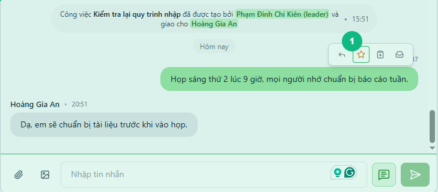
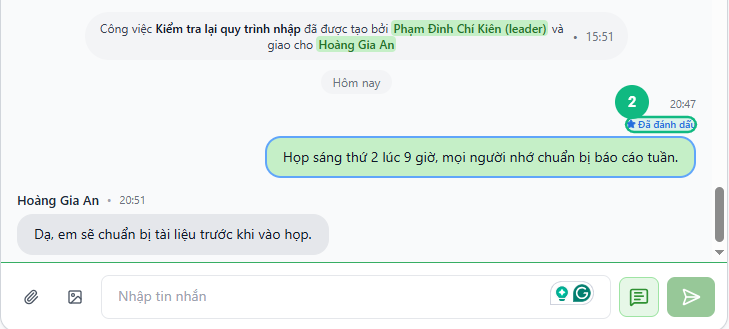
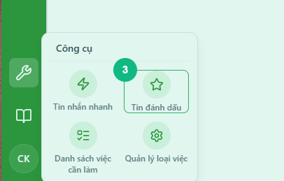
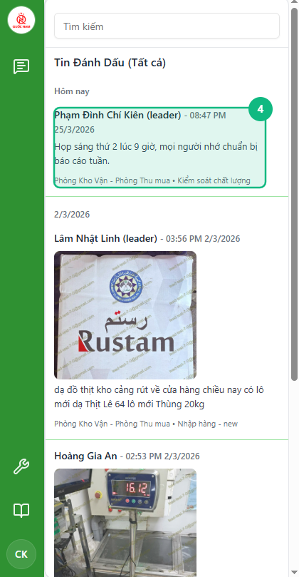

## Khi nào dùng
Khi bạn đọc một tin nhắn quan trọng trong chat — chỉ thị công việc, thông tin cần nhớ, thỏa thuận với đồng nghiệp — và muốn lưu lại để tìm về sau mà không cần cuộn ngược lên tìm thủ công.

## Điều kiện
- Đã đăng nhập vào hệ thống
- Đang ở trong một cuộc trò chuyện (nhóm hoặc tin nhắn cá nhân)

<Callout type="note">
Tin nhắn đã đánh dấu là **riêng của bạn** — người khác trong nhóm không thấy bạn đang đánh dấu tin nhắn nào.
</Callout>

## Các bước

### Bước 1 — Di chuột lên tin nhắn muốn đánh dấu

Di chuột vào bong bóng tin nhắn. Nhóm nút thao tác nhỏ hiển thị ngay cạnh tin nhắn, trong đó có biểu tượng **ngôi sao** (☆).

### Bước 2 — Bấm biểu tượng ngôi sao để đánh dấu

Bấm vào biểu tượng ngôi sao (☆). Biểu tượng chuyển sang màu vàng (★) và nhãn **Đã đánh dấu** hiện bên trên tin nhắn — báo hiệu tin nhắn đã được lưu thành công.

<Callout type="tip">
Muốn bỏ đánh dấu, bấm lại biểu tượng ngôi sao một lần nữa. Biểu tượng sẽ trở về dạng rỗng (☆) và nhãn **Đã đánh dấu** biến mất.
</Callout>

### Bước 3 — Mở danh sách tin nhắn đã đánh dấu

Bấm vào biểu tượng **Công cụ** (hình cờ lê) trên thanh dọc bên trái. Trong bảng bật ra, bấm ô **Tin đánh dấu** (biểu tượng ngôi sao). Cột **Tin Đánh Dấu** mở ra bên phải, hiển thị toàn bộ tin nhắn bạn đã đánh dấu từ mọi cuộc trò chuyện.

### Bước 4 — Bấm vào một tin nhắn để xem trong ngữ cảnh gốc

Bấm vào bất kỳ tin nhắn nào trong danh sách. Hệ thống tự chuyển sang đúng cuộc trò chuyện và cuộn đến vị trí tin nhắn đó để bạn xem lại toàn bộ ngữ cảnh xung quanh.

## Kết quả mong đợi
Tin nhắn được đánh dấu lưu lại trong danh sách **Tin Đánh Dấu** cho đến khi bạn chủ động bỏ đánh dấu. Bạn có thể bấm vào bất kỳ tin nhắn nào trong danh sách để nhảy về đúng vị trí trong cuộc trò chuyện ban đầu.

## Lỗi thường gặp

| Lỗi | Nguyên nhân | Cách xử lý |
|-----|-------------|------------|
| Biểu tượng ngôi sao không hiện khi di chuột | Chưa di chuột vào đúng vùng bong bóng tin nhắn | Di chuột trực tiếp vào phần nội dung của tin nhắn |
| Danh sách **Tin Đánh Dấu** trống dù đã đánh dấu | Trang vừa tải lại, dữ liệu chưa đồng bộ | Đợi vài giây rồi bấm lại ô **Tin đánh dấu** |
| Bấm vào tin nhắn trong danh sách nhưng không chuyển được | Cuộc trò chuyện đó đã bị xóa hoặc bạn không còn trong nhóm | Liên hệ quản trị viên để kiểm tra quyền truy cập |

## Bài liên quan
- [Cách vào nhóm chat và gửi tin nhắn](/web/chat-nhom)
- [Cách xem lại danh sách tin đánh dấu và ngữ cảnh](/web/bookmark-xem-lai)

---

*Cập nhật lần cuối: 2026-03-24 — Phiên bản ứng dụng: 1.0.0*
