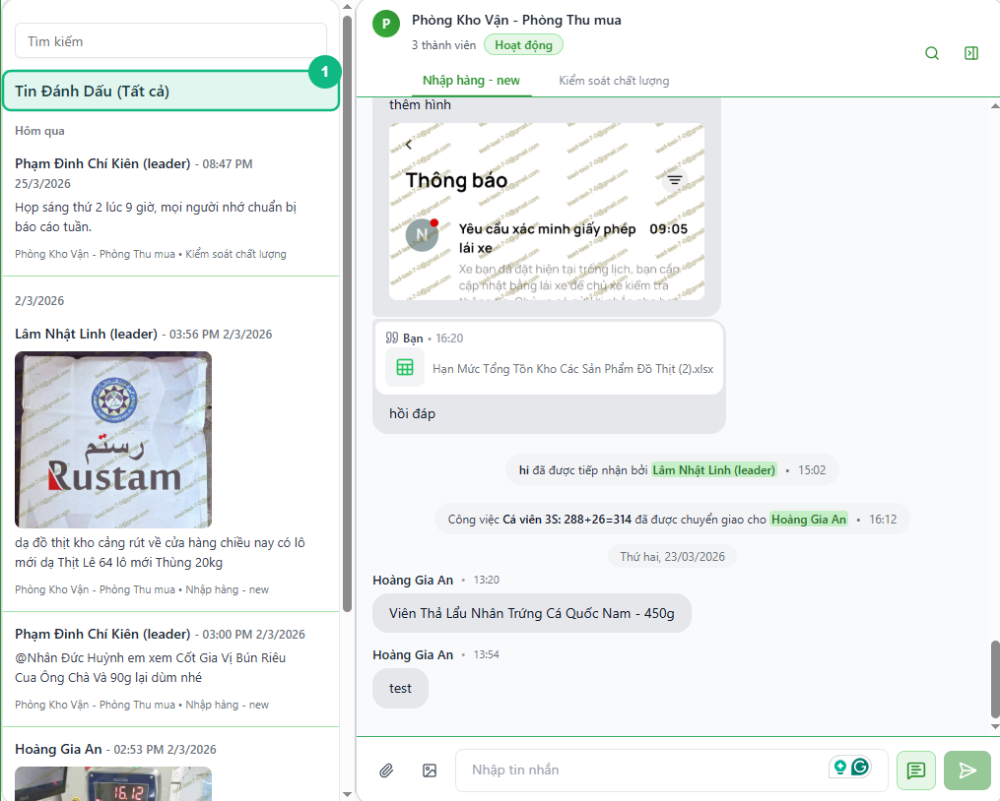
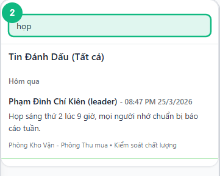
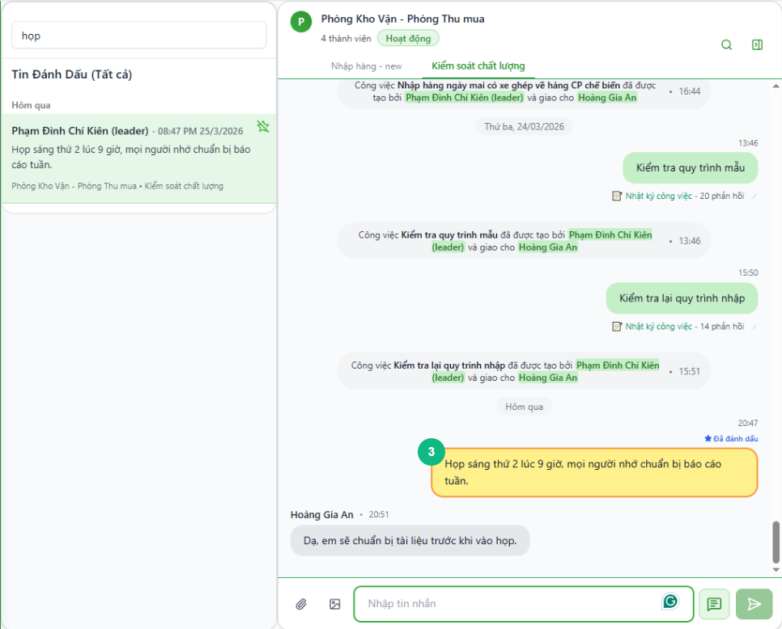
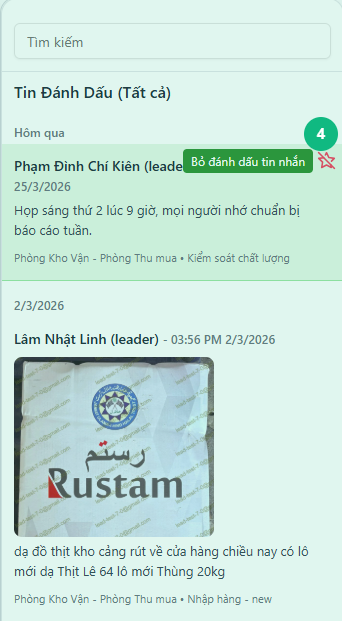

## Khi nào dùng
Khi bạn đã đánh dấu một số tin nhắn quan trọng trước đó và muốn mở lại danh sách để tìm kiếm, xem nội dung, hoặc nhảy thẳng về vị trí tin nhắn đó trong cuộc trò chuyện gốc.

## Điều kiện
- Đã đăng nhập vào hệ thống
- Đã có ít nhất một tin nhắn được đánh dấu (xem bài [Cách đánh dấu tin nhắn quan trọng](../28-bookmark-danh-dau))

<Callout type="note">
Danh sách này tổng hợp tin nhắn đánh dấu từ **tất cả** cuộc trò chuyện — nhóm và cá nhân — theo thứ tự thời gian gửi, mới nhất ở trên.
</Callout>

## Các bước

### Bước 1 — Mở cột Tin Đánh Dấu từ bảng Công cụ

Bấm biểu tượng **Công cụ** (hình cờ lê) trên thanh dọc bên trái. Trong bảng bật ra, bấm ô **Tin đánh dấu**. Cột **Tin Đánh Dấu** thay thế danh sách cuộc trò chuyện ở bên trái màn hình.

### Bước 2 — Tìm kiếm trong danh sách

Nhập từ khóa vào ô **Tìm kiếm** ngay đầu cột để lọc nhanh tin nhắn cần tìm. Danh sách hiển thị tên người gửi, nội dung tin nhắn (tối đa 100 ký tự), và tên nhóm — giúp bạn nhận ra đúng tin nhắn cần xem.

<Callout type="tip">
Mỗi hàng trong danh sách hiển thị tên nhóm và cuộc trò chuyện ở dòng nhỏ phía dưới. Đây là cách nhanh nhất để nhớ lại tin nhắn đó đến từ đâu trước khi bấm vào.
</Callout>

### Bước 3 — Bấm vào tin nhắn để xem trong ngữ cảnh gốc

Bấm vào hàng tin nhắn muốn xem. Hệ thống tự chuyển sang đúng cuộc trò chuyện — nếu cần thì đổi cả nhóm — và cuộn đến vị trí tin nhắn đó. Tin nhắn được **nổi sáng** (nền vàng, viền cam) trong khoảng 2–3 giây để bạn nhận ra ngay.

### Bước 4 — Bỏ đánh dấu ngay trong danh sách (nếu cần)

Di chuột vào hàng tin nhắn trong danh sách. Biểu tượng **bỏ đánh dấu** (ngôi sao có gạch — ☆̶) xuất hiện ở góc trên bên phải. Bấm vào đó để xóa tin nhắn khỏi danh sách mà không cần quay lại cuộc trò chuyện gốc.

## Kết quả mong đợi
Bấm vào tin nhắn trong danh sách → hệ thống nhảy thẳng đến đúng cuộc trò chuyện và đúng vị trí, tin nhắn nổi sáng trong 2–3 giây. Cột Tin Đánh Dấu vẫn mở song song để bạn tiếp tục xem các tin nhắn khác mà không mất danh sách.

## Lỗi thường gặp

| Lỗi | Nguyên nhân | Cách xử lý |
|-----|-------------|------------|
| Danh sách trống dù đã đánh dấu | Dữ liệu chưa đồng bộ sau khi tải trang | Đợi 2–3 giây hoặc tải lại trang rồi mở lại cột |
| Bấm vào tin nhắn nhưng không chuyển được | Tin nhắn thuộc cuộc trò chuyện không còn quyền truy cập | Liên hệ quản trị viên kiểm tra quyền |
| Tin nhắn không nổi sáng sau khi chuyển | Tin nhắn quá cũ, chưa tải về | Hệ thống đang tải thêm — đợi thêm 1–2 giây |
| Ô Tìm kiếm không lọc được kết quả | Tính năng tìm kiếm đang trong quá trình hoàn thiện | Cuộn tay trong danh sách để tìm |

## Bài liên quan
- [Cách đánh dấu tin nhắn quan trọng](/web/bookmark-danh-dau)
- [Cách vào nhóm chat và gửi tin nhắn](/web/chat-nhom)

---

*Cập nhật lần cuối: 2026-03-24 — Phiên bản ứng dụng: 1.0.0*
