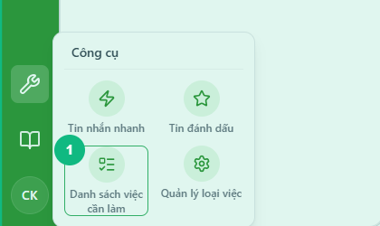
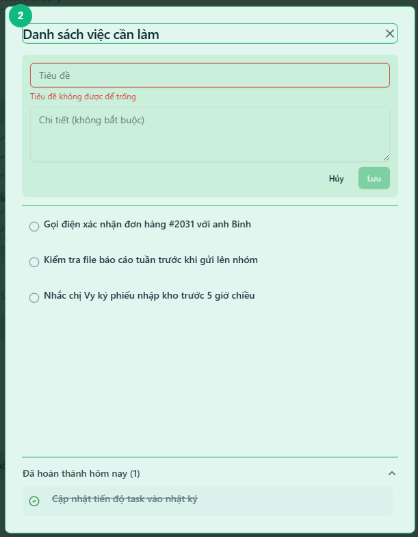
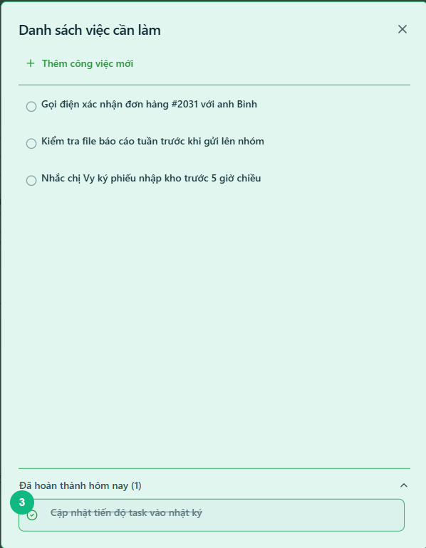
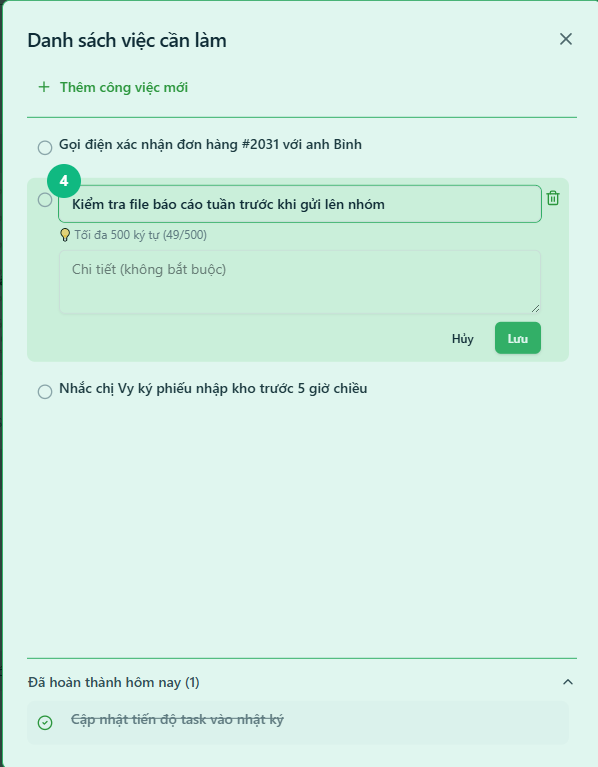

## Khi nào dùng
Khi bạn muốn tự ghi lại những việc nhỏ cần nhớ trong ngày — nhắc nhở bản thân, ghi tạm đầu việc chưa có trong hệ thống giao việc — và đánh dấu hoàn thành từng việc khi xong.

## Điều kiện
- Đã đăng nhập vào hệ thống

<Callout type="note">
Danh sách việc cần làm là **của riêng bạn** — không ai khác xem được. Các việc đã hoàn thành chỉ hiển thị trong ngày hôm đó, sang ngày hôm sau sẽ không còn xuất hiện nữa.
</Callout>

## Các bước

### Bước 1 — Mở hộp thoại Danh sách việc cần làm

Bấm biểu tượng **Công cụ** (hình cờ lê) trên thanh dọc bên trái. Trong bảng bật ra, bấm ô **Danh sách việc cần làm**. Hộp thoại **Danh sách việc cần làm** mở ra ở giữa màn hình.

### Bước 2 — Thêm một việc mới

Bấm nút **+ Thêm công việc mới** phía trên danh sách. Ô nhập liệu hiện ra gồm **Tiêu đề** (bắt buộc) và **Chi tiết** (không bắt buộc). Nhập tiêu đề công việc rồi bấm **Lưu**.

<Callout type="tip">
Ô **Chi tiết** dùng để ghi thêm thông tin bổ sung nếu cần — ví dụ: số điện thoại cần gọi, tên file cần kiểm tra. Nếu không cần, bỏ trống cũng được.
</Callout>

### Bước 3 — Đánh dấu hoàn thành một việc

Bấm vào biểu tượng **vòng tròn** (○) bên trái tên việc. Việc đó chuyển xuống phần **Đã hoàn thành hôm nay**, tên bị gạch ngang và biểu tượng chuyển thành dấu tích xanh (✓). Bấm lại dấu tích để khôi phục việc về danh sách đang làm.

### Bước 4 — Sửa tên hoặc xóa một việc

Bấm thẳng vào tên việc để mở ô chỉnh sửa — sửa nội dung rồi bấm **Lưu**. Để xóa, di chuột vào việc đó rồi bấm biểu tượng **thùng rác** (🗑) xuất hiện ở góc phải — xác nhận xóa trong hộp thoại hiện ra.

## Kết quả mong đợi
Danh sách hiển thị đầy đủ các việc chưa xong ở trên và các việc đã hoàn thành hôm nay ở phía dưới. Mỗi lần mở lại hộp thoại, danh sách được cập nhật mới nhất từ máy chủ.

## Lỗi thường gặp

| Lỗi | Nguyên nhân | Cách xử lý |
|-----|-------------|------------|
| Bấm **Lưu** nhưng không thêm được | Ô Tiêu đề đang trống | Nhập ít nhất một ký tự vào ô Tiêu đề trước khi lưu |
| Biểu tượng thùng rác không hiện | Chưa di chuột vào đúng hàng việc | Di chuột vào vùng chứa tên việc — thùng rác chỉ hiện khi hover |
| Danh sách trống dù đã thêm việc trước đó | Việc đã được hoàn thành và qua ngày hôm sau | Việc hoàn thành chỉ lưu trong ngày — thêm lại nếu cần |
| Không thể sửa việc đã hoàn thành | Tính năng chỉnh sửa bị khóa khi việc đã xong | Bấm dấu tích để khôi phục về đang làm, sau đó mới sửa |

## Bài liên quan
- [Cách vào nhóm chat và gửi tin nhắn](/web/chat-nhom)
- [Cách mở danh sách tin đánh dấu và xem lại ngữ cảnh](/web/bookmark-xem-lai)

---

*Cập nhật lần cuối: 2026-03-24 — Phiên bản ứng dụng: 1.0.0*
