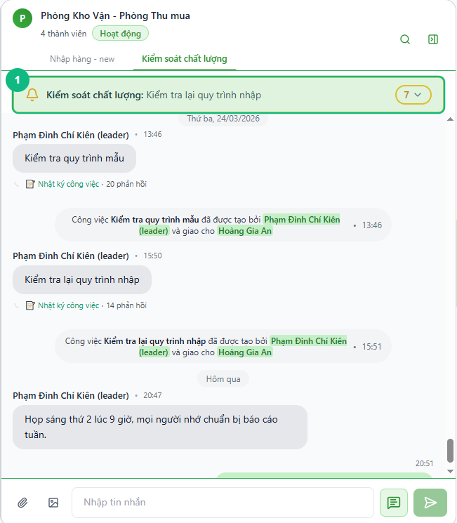
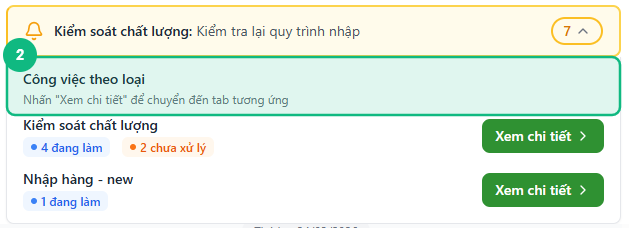
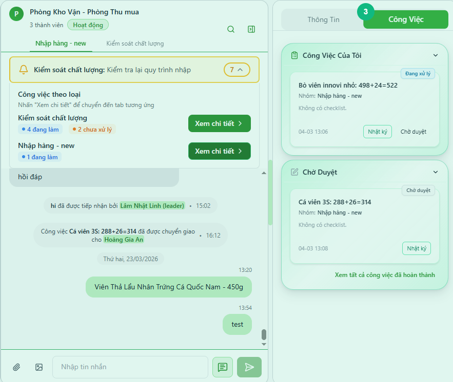
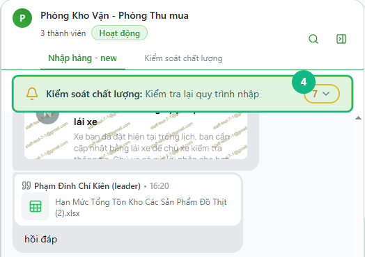

## Khi nào dùng
Khi bạn đang trong một nhóm chat và muốn xem nhanh tổng số công việc chưa xong theo từng loại việc — hoặc muốn nhảy thẳng vào tab công việc của một loại việc cụ thể mà không cần thoát khỏi chat.

## Điều kiện
- Đã đăng nhập vào hệ thống
- Đang ở trong một nhóm chat có ít nhất một công việc đang ở trạng thái **Chưa xử lý** hoặc **Đang xử lý**

<Callout type="note">
Thanh thông báo chỉ hiện khi nhóm chat đang mở có công việc chưa xong. Nếu tất cả công việc đã hoàn thành, thanh sẽ tự ẩn đi.
</Callout>

## Các bước

### Bước 1 — Nhận biết thanh thông báo công việc

Khi mở một nhóm chat có công việc chưa xong, thanh thông báo màu vàng (🔔) xuất hiện ngay phía dưới tiêu đề nhóm. Thanh hiển thị tên loại việc được cập nhật gần nhất và tổng số công việc chưa xong trong ô tròn bên phải.

### Bước 2 — Bấm vào thanh để xem chi tiết theo từng loại việc

Bấm vào thanh thông báo để mở rộng. Bảng chi tiết trượt xuống, liệt kê từng loại việc kèm số lượng công việc theo trạng thái — **đang làm** (xanh) và **chưa xử lý** (cam).

### Bước 3 — Bấm "Xem chi tiết" để chuyển thẳng sang tab công việc

Bấm nút **Xem chi tiết** bên phải tên loại việc muốn xem. Hệ thống tự chuyển sang tab **Công Việc** ở cột bên phải và hiển thị đúng loại việc vừa chọn — không cần tìm thủ công.

### Bước 4 — Thu gọn thanh thông báo

Bấm lại vào thanh thông báo một lần nữa để thu gọn bảng chi tiết. Thanh vẫn còn hiển thị (không bị ẩn) để tiếp tục nhắc nhở.

## Kết quả mong đợi
Bấm **Xem chi tiết** → hệ thống chuyển sang tab Công Việc bên phải, hiển thị đúng loại việc vừa chọn, và thanh thông báo vẫn hiện phía trên khung chat để tiếp tục theo dõi.

## Lỗi thường gặp

| Lỗi | Nguyên nhân | Cách xử lý |
|-----|-------------|------------|
| Không thấy thanh thông báo khi vào nhóm | Nhóm không có công việc đang xử lý | Kiểm tra lại — thanh chỉ hiện khi có công việc ở trạng thái Chưa xử lý hoặc Đang xử lý |
| Thanh hiện nhưng số lượng không đúng | Dữ liệu chưa đồng bộ | Chờ vài giây hoặc tải lại trang — số tự cập nhật qua kết nối thời gian thực |
| Bấm "Xem chi tiết" nhưng không chuyển tab | Cột bên phải đang bị thu gọn | Kéo rộng cửa sổ hoặc mở lại cột chi tiết bên phải |

## Bài liên quan
- [Cách vào nhóm chat và gửi tin nhắn](/web/chat-nhom)
- [Cách tạo và quản lý danh sách việc cần làm trong ngày](/web/todo-list)

---

*Cập nhật lần cuối: 2026-03-24 — Phiên bản ứng dụng: 1.0.0*
